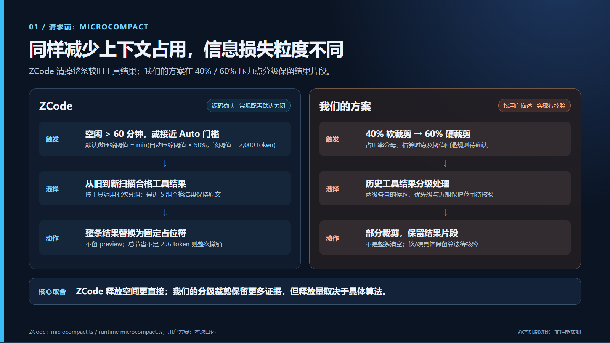
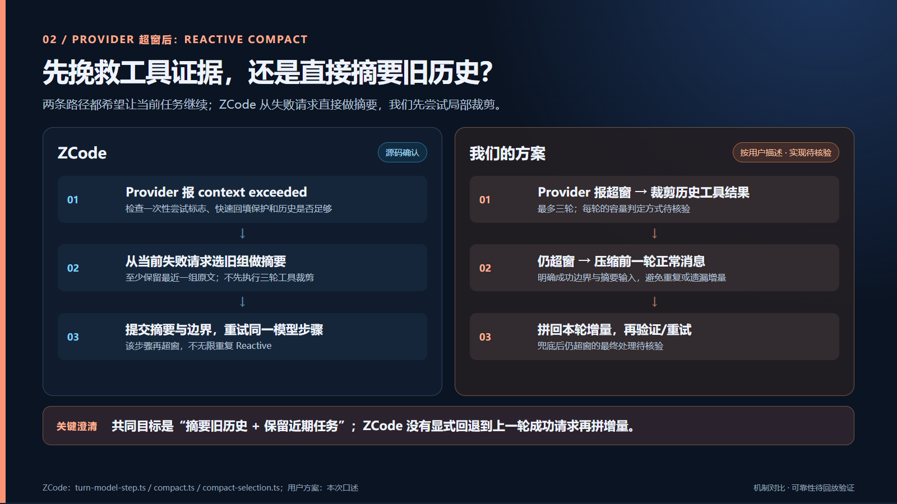

# Microcompact 与 Reactive Compact：ZCode 与我们的方案

> 汇报用途：解释两套机制如何在上下文压力出现前、Provider 已拒绝请求后分别减压，并说明信息保留与恢复可靠性的取舍。ZCode 一侧依据当前仓库源码静态分析；“我们的方案”只依据本次用户描述，未核验自研实现。源码研究基线 `872ad960de7ec172591f7e1952f7849229f94521`，当前文档提交另见 Git 历史。本文不把本地估算当成 Provider 的真实 token 数，也不声称做过超窗实测。

两图的[可编辑 HTML 版本](compact-comparison-slides.html)可直接作为讲解底稿或重新导出；PNG 为 16:9、1600×900。

## 汇报主张：两级减压，取舍落在“保留什么”与“何时付出摘要成本”

Microcompact 是请求前的局部治理，只碰旧工具结果；Reactive Compact 是 Provider 已报告超窗后的恢复。ZCode 的 Microcompact 在满足时间或容量门槛时，**整条替换**较旧的合格工具结果；ZCode 的 Reactive 不先裁工具，而是直接从当前请求选择旧轮做摘要。我们的方案在两个阶段都优先**部分裁剪工具结果**，Reactive 最多做三轮，仍超窗才进入“压缩旧历史、拼回本轮增量”的兜底。两者共同目标是给模型腾空间；差别在信息损失的粒度、摘要调用时机以及恢复状态的复杂度。

**关键纠偏：**“我们的兜底与 ZCode 一致”只能用于描述“旧历史摘要 + 近期内容续接”这个抽象目标。ZCode 源码并未显式回退到上一轮成功的 Provider 消息后再拼增量；它从**这次失败请求的 `activeEntries`** 投影，按 assistant-started 轮次选旧组摘要、保留最近组，提交新历史后重试同一个 model step。[Reactive 入口](../../../apps/zcode-cli/packages/core/src/runtime/methods/compact.ts) · [选组](../../../apps/zcode-cli/packages/core/src/runtime/helpers/compact-selection.ts) · [提交](../../../apps/zcode-cli/packages/core/src/runtime/methods/compact-active.ts)

## 第一幕：请求前的 Microcompact

| 决策 | ZCode：当前源码确认 | 我们的方案：用户描述 |
| --- | --- | --- |
| 是否运行 | 每个 model step 前检查，但清理开关须显式设为 `true`；已追常规组装路径默认未开启。 | 在特定容量阈值进入两级裁剪；是否默认开启、是否还有时间触发未给出。 |
| 触发 | 距上次 assistant 完成 **严格超过 60 分钟**，或本地投影估算 token 达到微压缩门槛。默认门槛是“完整自动压缩门槛的 90%”与“该门槛减 2,000 token”取较小者，**不是整个 context window 的 90%**。 | 上下文占用到 **40% 软裁剪、60% 硬裁剪**。目前按用户表达理解为同一容量口径的两个门槛；分母、估算器和滞回规则待核验。 |
| 选谁 | 仅九类工具（Read/Bash/Grep/Glob/WebFetch/WebSearch/Edit/Write/ApplyPatch）；默认跳过错误、已清理和含媒体的结果。按 assistant 的工具调用批次从旧到新收集，只保留最近 **5 组合格批次**原文。 | 对历史工具结果做局部裁剪；软/硬两级具体候选范围、优先级和最近结果保护范围未给出。 |
| 改什么 | 旧合格组中每条选中的 tool result **整个 content** 换成固定的 `[Old tool result content cleared]`；不留前后片段、预览或摘要。工具 ID、调用入参和顺序不动。 | 两级都裁剪工具结果正文，**不整条清空/占位替换**；软、硬各保留哪些片段及保留量待核验。 |
| 何时提交 | 替换后用同一估算器重算；总节省不足默认 **256 token** 时全部撤销。成功只改 Runtime 历史与本轮 entries，不回写持久 Session 的原 tool part。 | 已知是两个压力级别；是否有最小收益、持久化或冷恢复重放规则未给出。 |

ZCode 的请求前顺序是 **Microcompact → Auto Compact → 普通模型请求**。Microcompact 的投影只是在内存里构造“可能送给模型的消息”用于估算，既不是 Provider 调用，也不包含之后才确定的完整 wire/工具 schema。若只发生 Microcompact，没有完整 compact boundary，冷恢复仍能从持久 tool part 重建旧全文；下一次模型步再检查是否清理，不能把运行时节省视为跨重启稳定收益。[调用顺序](../../../apps/zcode-cli/packages/core/src/runtime/methods/turn-loop.ts) · [算法及触发](../../../apps/zcode-cli/packages/core/src/compact/microcompact.ts) · [回写与开关](../../../apps/zcode-cli/packages/core/src/runtime/methods/microcompact.ts) · [恢复](../../../apps/zcode-cli/packages/core/src/runtime/methods/resume.ts)

**演示用假设：**若本地窗口占用到 45%，我们的方案进入软裁剪，尽量保留工具结果中的有用片段；到 65% 再进入硬裁剪。这个例子只演示分级决策，**不代表**软、硬的实际片段算法或裁后 token 数。相反，ZCode 是否在 45%/65% 动作不能靠这两个比例判断：它还看距上次完成时间、模型窗口、输出预留和自身开关。

**设计洞察：**ZCode 的动作单位简单且释放空间可预期，但旧结果的内容直接从后续模型上下文消失；我们的方案保留局部证据，理论上有利于后续引用与诊断，但每轮可释放空间取决于裁剪算法，硬裁后仍可能超窗。两边若改变已缓存的消息前缀，都可能影响后续 Prompt Cache 复用；实际命中率需要 Provider usage 数据，不能从静态代码或方案描述推出。[ZCode 缓存边界](../topics/b-context-management.md)

## 第二幕：Provider 已报告超窗后的 Reactive Compact

| 步骤 | ZCode：当前源码确认 | 我们的方案：用户描述 |
| --- | --- | --- |
| 入口 | 普通模型请求抛出可识别的 context-exceeded 错误，或满足额外条件的超窗 finish reason；不是本地 90%/其他阈值触发。 | 模型请求超窗后进入 Reactive；具体 Provider 错误分类待核验。 |
| 第一动作 | 同一 model step 最多一次**完整摘要压缩尝试**，不先执行专门的历史工具结果三轮裁剪。Microcompact 若启用，已在该 model step 请求前单独检查过。 | 先对历史工具结果逐轮部分裁剪，**最多三轮**；每轮如何确认仍超窗（本地估算、Provider 重试或两者）待核验。 |
| 摘要输入 | 从**当前失败请求**的 entries 重投影；按 assistant-started 轮次切分旧历史，至少保留最近一组原文。可依据超额差值扩大保留区以缩小摘要请求；摘要请求自身超窗时可继续调整。 | 三轮仍未恢复时，回到“前一轮正常 msg”作为旧历史基线，对它做压缩，再拼回本轮增量 msg。这里的“正常”边界及增量的工具/媒体/失败记录归属待核验。 |
| 提交与重试 | 持久化隐藏摘要、后置提醒和 CompactBoundary，替换 Runtime 与当前 request entries，重建 turn machine，重试**同一**模型步骤。若重试仍超窗，一次尝试标志阻止无限 Reactive 循环。 | 兜底摘要后拼回本轮增量，再验证是否可放入窗口；失败后的重试次数、回滚/保留状态待核验。 |
| 失败路径 | compact 禁用、历史不足、快速回填保护、摘要失败或再次超窗都可能终止并报告错误。Reactive 的摘要请求**不使用**手动 compact 可用的“丢弃最旧摘要组”降级。 | 工具裁剪三轮后有摘要兜底；摘要及拼接仍超窗时的最终处理未给出。 |

ZCode 的“最多一次”指**本次普通 model step 的 Reactive 完整压缩尝试**，不排除这次压缩内部因 prompt-too-long、媒体过大而重选摘要输入或重试摘要请求；不能误写为“最多一次模型 API 调用”。[超窗恢复门](../../../apps/zcode-cli/packages/core/src/runtime/methods/turn-model-step.ts) · [Reactive 实现](../../../apps/zcode-cli/packages/core/src/runtime/methods/compact.ts) · [摘要内部处理](../../../apps/zcode-cli/packages/core/src/runtime/methods/compact-active.ts)

**对比结论：**我们的路径把摘要模型调用推后，给工具结果局部裁剪三次机会；若这些回合能成功，可能保留更多对话结构并避免摘要质量波动。代价是最多三轮判断/重试的时延、状态与缓存变化，以及“前一轮正常 msg + 本轮增量”必须精确定义的边界。ZCode 的路径更短、一次性进入摘要，但在摘要失败或摘要后的请求仍超窗时没有必然成功保证。上述收益/代价是从两条机制推导的**设计假设**，不是双方实测性能结论。

## 建议的汇报叙事与验收指标

1. **问题：**长任务的工具结果快速占满上下文；本地估算与 Provider 判定可能不一致。先说明“请求前治理”和“超窗后恢复”是两个时机，避免把 Microcompact 与 Reactive 当同一个压缩函数。
2. **策略：**第一张图讲“ZCode 整条旧结果替换”与“我们 40%/60% 分级部分裁剪”；第二张图讲“ZCode 直接摘要一次”与“我们最多三轮工具裁剪再摘要”。
3. **洞察：**比较四个量：释放 token 的确定性、模型还能看到的证据、额外模型/Provider 请求成本、冷恢复后的状态一致性。不要单用“压缩率”判优。
4. **验证计划：**用同一组长任务回放，记录每次治理前后 token、有效工具结果保留比例、Provider 超窗恢复成功率、每次恢复的模型调用数与耗时、后续任务正确率、cache-read token、冷恢复后的输入膨胀。没有这些数据时只汇报机制与可检验的取舍。

**仍需从我们实现核对的关键口径：**40%/60% 的分母与估算时点；软/硬的具体保留算法和回滚门槛；Reactive “三轮”的计数单位和每轮是否重发 Provider 请求；“上一轮正常 msg”的版本标识；本轮增量是否含刚失败的 assistant/tool 消息；兜底后仍超窗的处置与持久化边界。这些不影响本报告展示已知差异，但在写成“已实现且可靠”之前必须闭合。
