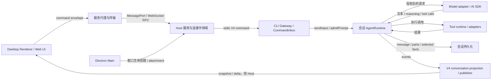
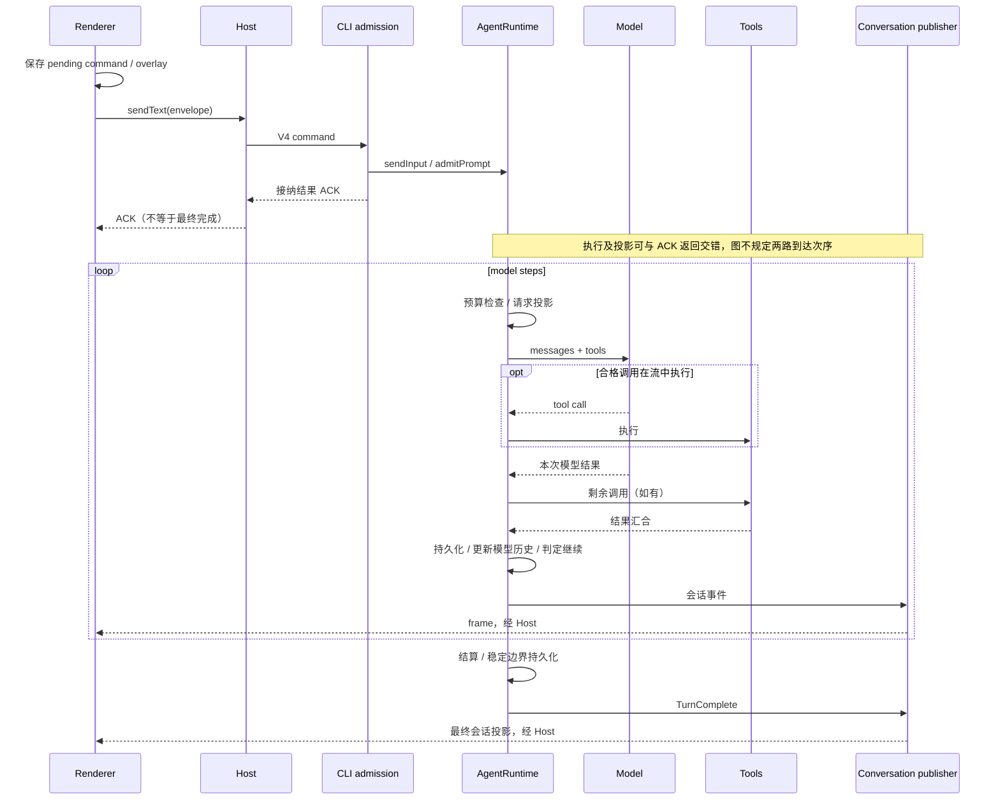

# ZCode 整体运行模型

基线：`872ad960de7ec172591f7e1952f7849229f94521`。本篇已依据 A/B 专题源码证据修正；未运行真实模型或完整应用。证据编号见[台账](research/evidence.md)，细节见[专题索引](index.md)。

## 先理解系统怎样工作

ZCode 的桌面主链路可以理解为：**界面提交意图，窗口 Host 路由并管理 CLI 进程，CLI 接纳命令并执行会话，模型与工具共同推动多步循环，CLI 再把会话事实投影给界面。** 一次发送并不等于一次模型调用；界面展示的消息也不等于模型请求里的 messages。[E01–E08]

这个系统最关键的分工是“提交与观察分开”：命令 RPC 返回 ACK；另一路 conversation topic 传来 snapshot/delta。ACK、模型单步完成、整个用户 turn 完成，是不同的时间点。Renderer 用 commandId 将乐观状态与后续权威投影对账，而不是收到 accepted 就自行生成完整会话事实。[E01、E03、E12]

图中是职责关系，省略了细粒度权限、排队和重试。Web 到 Host 的部署路径有变体；手机 attachment 复用已有执行端，不意味着每个客户端都新建 Agent。[E04、E05、E13] A/B 专题进一步确认：会话关闭不等于物理删除 transcript；完整 compact 通过隐藏 summary 与 boundary 选择 active history，而不是删除旧记录。[E16、E20]

## 状态由谁负责

| 层                         | 本轮已确认职责                                                                   | 不能与什么混淆                               |
| -------------------------- | -------------------------------------------------------------------------------- | -------------------------------------------- |
| Renderer / 共享 UI         | 输入草稿、提交恢复账本、乐观 overlay、会话投影缓存和展示                         | 本地提交账本不是 CLI 权威执行队列            |
| Electron Main              | 窗口和 Host 进程调度、attachment/端口转接                                        | Main 的窗口到 Host 映射不是 session 执行状态 |
| Host 服务                  | workspace 路由、CLI 进程复用、连接作用域、协议请求/事件转发，维护派生 task index | task index 不是模型历史的唯一真相            |
| CLI Gateway / CommandInbox | 命令 schema/去重、按 session 串行接纳、持久输入事实与 ACK                        | admission gate 不等于持锁等待整个长任务完成  |
| Core AgentRuntime          | 会话历史、当前 turn、runtime command queue、模型步骤、工具和权限协作             | 一个 product turn 不等于一个 model step      |
| 存储与模型 adapters        | transcript 持久化、模型接口与外部 I/O 适配                                       | 默认内存 eventStore 不等于 SQLite transcript |

以上见 E01–E08。当前现代 V4 输入入口是 `sendConversationCommandV4`；不能把 legacy session facade 的 `createSession` 强行插入每次 UI 提交路径。`packages/client` 在这条链上提供 UI 远程服务代理；实际模型调用发生在 CLI model adapter，不能因包名把前者当模型 SDK。[E02、E04、E09]

Host 生命周期属于窗口而非 Renderer 加载周期：Renderer reload 在已有 Host 存活时重新挂 MessagePort。Host 再按 workspaceKey 复用 CLI 客户端并去重并发启动。因而“刷新界面”和“重启执行 runtime”是两种不同事件。[E04]

## 一次正常任务的端到端过程

以下用“用户在已有会话发送请求，模型使用工具，再作答”贯穿。首次创建会话、权限等待、运行中追加输入属于分支，后续专题分别展开。

### 1. 输入成为有身份的命令

`SessionPane` 将文本、附件引用和本次 submission 配置组成 `sendText`；`createCommandEnvelope` 补充 commandId、clientId、sessionId、issuedAt，特定 CAS/row 操作还需要 revision/epoch。上行前先记录 pending command，供发送异常或刷新后的对账使用。[E01]

UI 经 `V4ConversationContext` 和 workspace connection registry 取得 transport，握手后调用服务的 `sendConversationCommandV4`。Desktop 底层通过 MessagePort 服务代理，Web 入口通过 WebSocket 连接服务。身份隔离不能只看工作目录字符串；路由还携带 workspaceIdentity，远程绑定涉及 remoteSessionId。[E02、E05]

### 2. Host 找到执行端，CLI 接纳命令

Host 取对应客户端、补全命令及可信连接信息，然后发 `V4_METHODS.command`。CLI Gateway 把命令交给 `CommandInbox`：先进入命令 key gate，再进入 per-session admission gate，分配接纳顺序并返回 execute outcome；执行接纳结果 settle 后释放 gate。[E04、E06]

接着 `startPromptTurn → app.sendInput → runtime.admitPrompt`。这又是一层执行接纳：根据当前 busy 状态与输入策略，决定启动、引导当前 turn、排队或拒绝。对准备立即启动的输入，先保留启动位置，再进入 runtime command queue。因此，协议串行接纳和运行时调度是两种职责，不宜统称“一条消息队列”。[E06、E07]

### 3. Runtime 建立用户回合

`executeTurnCommand` 发出 TurnStarted、持久化用户输入并进入 `runRegularTurnLoop`。会话 runtime 注入 sessionStore、modelFactory、工具与权限等依赖。默认 eventStore 是内存实现，同时还有单独的 sessionStore；不能从“有 eventStore”直接推导整个系统是可从事件日志完整恢复的架构。[E07、E08]

### 4. 每次模型调用重新组织上下文

循环先检查取消，再做 microcompact 和主动 compact 检查，处理适用的运行时输入、工具集合和 reminder，随后从本轮 request entries 投影出 Provider messages。模型是否支持会话中间的 system message，会影响这一步投影。[E09、E11]

ContextBuilder 的输出也不是一段拼好的 system prompt：它分出 system messages 与 meta-user attachments。Skills 元数据和项目指令/记忆索引可以注入后者，记忆使用说明可注入 system。工具说明通过请求 tools 字段提供，而不是重复镜像进 system prompt。[E14]

最后由 Core model 方法构造 ModelRequest，交给 adapter 和 AI SDK generateText/streamText。此处已追到模型适配边界，尚未核验每种 Provider 的最终 HTTP wire payload，尤其 reasoning、签名及特殊消息排序。[E09]

### 5. 模型流与工具形成反馈循环

符合条件的 tool call 可以在模型流期间启动；流结束后执行剩余调用，把流中与流后结果按 toolCallId 汇合，再按原调用列表顺序取回。结果持久化后以模型可见内容写入运行时请求历史，再进入后续模型步骤。[E10]

**说明性例子，未运行：**假设模型声明 A、B、C，实际工具按 B、C、A 完成。已读到的结果汇合点用 ID map 后按 A、B、C 的原列表取回结果。这能说明“完成顺序不决定此处的回灌顺序”，但不能证明 UI 流事件也是 A、B、C，也不能证明三个工具都允许并发——这些需要继续追调度策略和事件消费者。

### 6. 单次模型结束不等于任务结束

没有工具调用时，runtime 仍可能消费 inline guide，或通过 Stop Hook 附加上下文并继续同一 product turn。最终决定 break 后，外层结算目标使用量、在满足条件时持久化稳定 fork 边界，然后发出 TurnComplete。因而“assistant 已结束输出”和“用户回合已稳定完成”必须分别建模。[E12]

### 7. 会话事实回到界面

CLI publisher 发 conversation frame，Host 校验分流，经 RPC 订阅到 UI。UI 收到 snapshot 时整体替换；收到 delta 时要求序号连续，重复帧丢弃，断档进入恢复而不猜补内容。权威队列项或真实 userInput 出现同一 sourceCommandId 后，对应 sendText overlay 才退场。[E03、E04、E13]

这是正常链路的源码模型；并发与异常事件的完整偏序关系尚待下一阶段核验。

## 四种消息表示不能混用

| 表示       | 具体锚点                                                         | 与相邻层的差别                                                         |
| ---------- | ---------------------------------------------------------------- | ---------------------------------------------------------------------- |
| 持久化记录 | message/parts、input admission 与 promotion                      | 为恢复保存结构化事实，并非直接保存一份永远可原样发给模型的 messages    |
| 运行时对象 | MessageHistory 的 message/attachment entries、本轮 request state | 可加入动态 reminder；canonical history 与本轮临时请求材料需要分别追踪  |
| 模型输入   | buildRuntimeProviderRequestMessages → ModelRequest → adapter     | 经过顺序、模型能力和 cache-control 等转换；最终 Provider wire 仍待深入 |
| UI 展示    | conversation snapshot/deltas → ProjectionStore → React           | 投影包含状态、队列、展示行，不直接代表完整模型上下文                   |

证据 E03、E08–E10、E14。一个实际例子是工具错误：`state.error` 面向 UI/日志，`modelContent` 面向模型，两者可能不同；实现额外保存 modelContent 元数据用于冷恢复。不能读取 UI 错误文本就断言下一轮模型收到同样文本。[E10]

压缩也跨越这些层：auto/reactive 先保留最近的 **assistant-started group** 并摘要更早组；摘要请求超窗时可把更多最近组移到原文保留区，当前 Auto/Reactive 路径不使用“丢最旧组”兜底。成功后先持久化隐藏 summary 与 CompactBoundary，再替换 runtime history；冷恢复从最后有效 boundary 选择 active history，并按 preserved segment 重插最近原文。旧 transcript 没有被物理删除。[E20、E34]

工具大结果也体现分层：进程采集层可能已限制 inline、tail 和磁盘文件，通用 ToolExecutor 再对 handler 生成的模型内容执行 truncate 或 artifact。模型看到 preview 与路径；冷恢复保留当时的 `modelContent`，不会自动把全文重新注入。[E22]

项目 Memory 使用文件索引与按需读取：每次 Context 初始化只注入 `MEMORY.md` 索引，具体事实由模型按需 Read；成功 turn 后可由受限后台 Agent 根据 active durable messages 更新事实文件。写文件有先读后写、revision 检查和原子替换，减少陈旧覆盖；语义去重及跨 Runtime 事务一致性并非这套机制的保证。[E21、E25]

Context 管理是多级策略：Skills metadata 与 Memory index 控制常驻内容，完整正文按需读取；每步请求有输出 preflight、Provider usage/估算驱动的自动压缩、独立 40 MiB 媒体预算和 Provider cache marker。媒体预算保护最新真实用户附件，其余按从新到旧的完整媒体块选择，放不下的块变文字占位；Microcompact 则按旧合格工具批次整条替换结果，两者都不是在一条内容中间按 Token 切片。不同预算的单位与所有者不能合并为一个“token 裁剪器”。详见[上下文管理全貌](topics/b-context-management.md)。[E27、E32、E34]

Microcompact 清的是运行时历史和本轮请求中的旧工具结果，不回写 Session 的原 tool part；冷恢复重新从持久消息 hydrate，但若已有完整 compact boundary，仍按有效历史选择。跨会话上下文又有独立入口：`#sess_*` 只触发读取提示，需要时由 `ReadSessionContext` 按需从另一 Session 的持久记录提取；这与 Project Memory 的跨会话事实索引是两种机制。`model-io` JSONL 是有界诊断投影，不是 Session 恢复源。[E28、E29]

## Desktop 与手机：同一执行事实，不同交付形态

`desktop-continuous` 和 `web-remote-replayable` 的差别不只是传输媒介。profile 定义不同 flush 窗口、可流式字段、工具输出增量上限和 toolProgress 行为；它们由可信连接模式决定。replayable 的工具 output 流增量上限为 0，不等于没有最终工具结果。[E13]

共用 publisher 按 logEpoch 与 seq 判断恢复：基线仍在保留窗口则 resume，否则给 snapshot。因此也不能简化成“只有手机支持恢复”。手机的已有远程 workspace attachment 路径会核对窗口、会话和 workspace 身份，再接到现有窗口 Host，没有在该函数中新建另一份 Host/CLI。[E05、E13]

## 当前研究边界

A/B 源码专题已解释输入权威化、模型请求重建、工具闭合、reactive compact、冷恢复、Memory 并发保护、大结果完整性和 artifact 生命周期。基于源码可确认的是控制流与契约；Provider 外部行为、仓库外清理和具体远端部署下的路径可达性保持有边界未知。跨 Host owner/lease、子 Agent 与扩展机制尚未作为本批专题研究。
