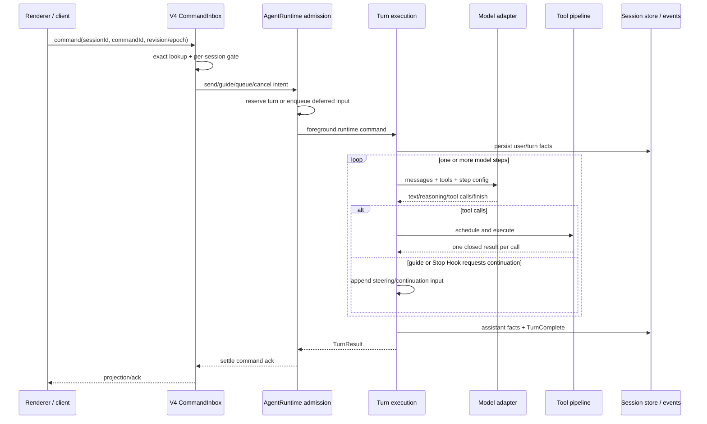

# A1：会话、输入准入与 Agent Loop

## 研究问题与边界

本专题回答三个相互依赖的问题：会话何时真正持久化；同一会话的输入如何去重、排队、引导或取消；一次已接纳输入如何跨多个模型步骤和工具步骤，最终形成产品层的完成事件。基线为 `872ad960de7ec172591f7e1952f7849229f94521`。结论来自静态源码追踪，未实际启动应用或 Provider。

## 整体运行模型

关键结论是：命令接收成功、运行时接纳、单次模型请求结束、完整 turn 结束和 UI 得到权威投影不是同一个提交点。系统用不同 ID、状态和事件分别表达这些边界，不能用一个 `success` 替代。

## 1. 会话创建、首次输入与关闭

`createSession` 总是先创建 deferred record；没有 `firstInput` 时不会立即进入 SQLite。若存在 `firstInput`，它通过与普通 `sendText` 相同的 prompt-turn 写路径晋升会话。空白首输入在 record 创建前拒绝，避免遗留无效草稿。首轮配置在首输入前应用；配置应用失败只记录警告，避免已经创建的 session 通过失败 ACK 对客户端表现为不存在。若首输入在 durable admission 后失败，则 best-effort 取消对应输入命令。[session-mgmt.ts:23-128](../../../apps/zcode-cli/packages/bootstrap/src/zcode-protocol-v4/commands/handlers/session-mgmt.ts)

`deleteSession` 在当前协议中的含义是关闭会话并清理运行时资源，并非物理删除 transcript；`renameSession` 则写入 runtime 的自定义标题。[session-mgmt.ts:132-172](../../../apps/zcode-cli/packages/bootstrap/src/zcode-protocol-v4/commands/handlers/session-mgmt.ts)

这一区分带来一个重要产品语义：UI 中“删除/关闭”的名称不能用来推断底层历史是否被抹除。持久记录的生命周期需要以 store 行为为准。

## 2. V4 命令准入：精确去重与每会话串行

`CommandInbox` 同时维护 `inFlight`、`liveInputs` 和有界的 `settled` 结果。处理新命令时先按 `sessionId + commandId` 做精确查询，再取得 per-session gate；等待 gate 后必须再次查询，防止等待期间另一请求已经完成同一命令。真正接纳时分配单调 `admissionSeq` 并注册 in-flight promise。[command-inbox.ts:107-211](../../../apps/zcode-cli/packages/bootstrap/src/zcode-protocol-v4/command-inbox.ts)

同一 command 的重试语义不是简单返回“已收到”：若原命令仍在执行，重试者等待它的最终结果，所以 create/fork 等返回值不会丢失。已接纳的 queue/guide intent 还能进入 `liveInputs`，避免被每会话最多 512 条的 settled LRU 淘汰；只有 transcript/cancel/failure 确认后才释放。[command-inbox.ts:223-267](../../../apps/zcode-cli/packages/bootstrap/src/zcode-protocol-v4/command-inbox.ts)

精确查询按 in-flight、live、settled、transcript、timeline、child、discarded 依次查找。row 类命令先检查 epoch，再检查 revision，以阻止旧窗口或旧投影状态覆盖新状态。[command-inbox.ts:271-451](../../../apps/zcode-cli/packages/bootstrap/src/zcode-protocol-v4/command-inbox.ts)

### 假设示例：网络重试

客户端发送 `commandId=c7` 创建会话并携带首输入，连接在 ACK 前断开。重连后再次发送 `c7`：若原调用仍在 `inFlight`，第二个调用等待同一 final promise；若已完成，则从 settled 或持久事实恢复结果。这个示例是源码语义推演，并非本次运行验证。

## 3. Runtime 准入：start、guide、queue 和 reject

协议层串行化之后，`AgentRuntime` 再根据 active turn 状态决定执行语义：

- 无 active turn 且没有 start reservation 时，预留 turn 并把可取消命令放入 runtime command queue；准入完成后，执行失败由 turn 事件和调用方消费。
- active turn 可 steer 且请求允许 guide 时，把输入作为 guide 注入当前 turn；带不兼容附件时不会强行 guide。
- 其余 busy 输入进入 queue，或在调用方明确要求时拒绝。

对应分支位于 [prompt-admission.ts:26-130](../../../apps/zcode-cli/packages/core/src/runtime/methods/prompt-admission.ts)。这说明 `CommandInbox` 的职责是协议命令的幂等与顺序，runtime admission 的职责是当前执行状态下的产品行为，两层不能合并理解。

runtime command queue 还有第三个边界：foreground execution。它持有覆盖整个 runtime command 的 AbortController，stop 可以携带 `expectedForegroundExecutionId` 避免取消已经切换的新执行。`sendQueuedNow` 的内部抢占会设置 `preserveQueueAutoDrainOnCancel`，从而区分用户手动 stop 与为了提升队列项而发生的内部取消。[runtime-command-queue.ts:415-475](../../../apps/zcode-cli/packages/core/src/runtime/methods/runtime-command-queue.ts)

## 4. 一个 turn 可以包含多个模型步骤

主 turn 在开始时固定执行配置并持久化输入，然后进入循环。每个 model step 都重新投影 Context 和 request entries；模型可能返回文本、reasoning 和工具调用。工具结果闭合后，下一模型步骤以更新后的 runtime history 发起。即使没有工具调用，inline guide 或 Stop Hook 也可能要求继续，所以“本次模型返回无 tool call”不等于产品 turn 已完成。[turn.ts:193-222](../../../apps/zcode-cli/packages/core/src/runtime/methods/turn.ts) [turn-loop.ts](../../../apps/zcode-cli/packages/core/src/runtime/methods/turn-loop.ts) [turn-guide-drain.ts:9-58](../../../apps/zcode-cli/packages/core/src/runtime/methods/turn-guide-drain.ts)

`TurnComplete` 在最终 assistant 内容已经持久化后发出；注释明确指出 projection/UI 只有到这个边界才能开放最终 assistant fork。[turn.ts:624-648](../../../apps/zcode-cli/packages/core/src/runtime/methods/turn.ts)

因此一次任务至少包含四种不同完成含义：

| 边界                | 表示什么                     | 不能推出什么            |
| ------------------- | ---------------------------- | ----------------------- |
| Command admission   | 命令身份和顺序已被接纳       | turn 已运行完成         |
| Model step finish   | 一次 Provider 流结束         | 工具已执行、turn 已终止 |
| Tool result closure | 某批 tool call 都有对应结果  | 后续不会再请求模型      |
| TurnComplete        | 产品 turn 已按持久化事实收束 | 所有客户端已收到并渲染  |

## 5. 冷恢复与历史重建

对不在内存中的持久会话，V4 subscribe 通过 single-flight coordinator 恢复；并发订阅加入同一 flight。它明确区分 store 中没有会话或宿主不支持恢复的 `sessionNotFound`，以及恢复中途失败的 `resumeFailed`。[cold-session-resume.ts:34-110](../../../apps/zcode-cli/packages/bootstrap/src/zcode-protocol-v4/cold-session-resume.ts)

hydrator 先选择当前有效分支和最后一个活跃 compact boundary，再把持久消息重建为 runtime entries。已完成工具结果优先恢复保存的 `metadata.modelContent`，因为 UI 展示错误文本可能与模型当时看到的内容不同；恢复时仍为 pending/running 的工具会变成明确的中断结果 `"[Tool execution was interrupted before resume]"`，以闭合 Provider 对 tool use/tool result 的配对。[session-history-hydrator.ts:45-195](../../../apps/zcode-cli/packages/core/src/agent/session-history-hydrator.ts) [session-history-hydrator.ts:201-255](../../../apps/zcode-cli/packages/core/src/agent/session-history-hydrator.ts)

### 冷恢复的异常处理顺序

`resumeFromStore` 先确认 Session 存在且未归档，再读取消息及 rewind/branch 指针；远端路径修复即使回写失败，也可使用内存修复继续。随后重置 runtime history/context、恢复 read-file state，**之后**才初始化 Context，防止 `MEMORY.md` 的已读状态与冷恢复后的模型上下文不一致。[resume.ts:59-155](../../../apps/zcode-cli/packages/core/src/runtime/methods/resume.ts)

接着收敛中断 compact timeline：同一 operation 已有 boundary 就改为 completed，否则改为 interrupted；started 与 retrying 均需处理。若 timeline 被修复，返回 `persistedMessagesReloadRequired`，让 V4 重读持久消息，避免订阅首帧短暂复活旧状态。有效历史按最后 boundary 和 branch 选择，保留段可重插 Provider 上下文，但计算最新 conversation/assistant anchor 时排除这段旧消息。[compact-persistence.ts:200-287](../../../apps/zcode-cli/packages/core/src/runtime/methods/compact-persistence.ts) [resume.ts:153-190](../../../apps/zcode-cli/packages/core/src/runtime/methods/resume.ts) [resume.ts:315-323](../../../apps/zcode-cli/packages/core/src/runtime/methods/resume.ts)

hydrator 对 completed tool 优先恢复结构化媒体布局、缺失/损坏时退回 legacy output；error tool 优先恢复当时的 `modelContent`；仍未完成的 tool 补中断结果。此处是**重建可继续的消息协议**，没有证据表明它会重新执行中断前的工具。最后 runtime 恢复权限、执行配置、todo/target 等会话连续性状态并发出 `SessionResumed`；零持久消息或零有效历史会记警告，不自动等同于 Session 不存在。[session-history-hydrator.ts:111-194](../../../apps/zcode-cli/packages/core/src/agent/session-history-hydrator.ts) [resume.ts:190-315](../../../apps/zcode-cli/packages/core/src/runtime/methods/resume.ts)

设计推断：恢复策略优先保证“下一次模型请求结构合法、仍属于当前 branch”，而不是复演进程崩溃前的执行现场。代价是后台任务、进行中的外部副作用不能仅靠 transcript hydration 证明已恢复；需要各自的 owner/lease 或独立补偿机制。

## 异常与一致性契约

- stale epoch/revision 在进入真实处理前被拒绝，避免旧客户端覆盖新投影。
- durable admission 后的失败需要产生可查询结果或释放 live input，不能只丢失内存 promise。
- stop 需要匹配 foreground identity；迟到的旧 turn complete 不能夺走新执行的队列授权。
- 恢复必须闭合未完成工具对，否则下一次 Provider 请求可能违反消息协议。
- UI 状态、持久 transcript 和 runtime history 各有转换点；其中任一层的“存在”都不能替代其他层的事实。

## 设计取舍与迁移条件

以下为研究者推断：双层准入增加了状态和恢复复杂度，但把网络幂等、客户端投影版本与 Agent 运行状态分离，因此更适合多客户端、断线重连和 busy steering。迁移时至少需要保留稳定 command identity、per-session 顺序、foreground execution identity、持久化后的可查询结果，以及 guide/queue 的明确语义。如果产品只有单进程单客户端，完整 V4 inbox 可能偏重，但不能只删除去重层而保留可重试 API。

## 验证与未知

- 已完成：生产源码静态追踪。
- 仓库依赖已安装，typecheck 通过；现有测试检索未发现直接覆盖 CommandInbox/runtime admission 的用例。尚未执行真实 UI/CLI/Provider 场景。
- 在仓库文件名搜索中未定位到直接以这些实现命名的测试；这只表示本次搜索未找到，不能推断没有间接覆盖。
- compact boundary 的恢复选择与 Provider 消息转换已分别由 [B2](b-compaction.md) 和 [B1](b-message-context-and-provider-input.md) 补充；外部 Provider 精确 wire 行为不属于当前源码证据。
