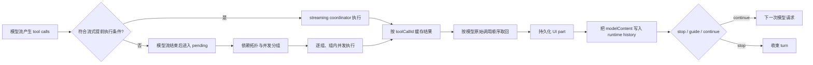

# A2：工具调度、权限、执行与结果闭合

## 研究问题与边界

本专题追踪模型产生 tool calls 后，系统如何判断并发、怎样处理流式提前执行、如何等待权限和超时、怎样汇合结果，以及失败或 stop 怎样影响后续工具和下一次模型请求。基线为 `872ad960de7ec172591f7e1952f7849229f94521`。大输出的截断、落盘和恢复读取在 B 阶段单独展开。

## 整体流程

核心契约不是“Promise.all 并发”：执行完成顺序、UI 更新顺序、持久化顺序和下一次模型请求中的 tool result 顺序分别由不同代码决定。这里的最终汇合以 `toolCallId` 关联，并按模型最初的 `coreToolCalls` 顺序取回。

## 1. 静态调度：依赖、并发资格与并发上限

`ToolScheduler` 为调用建立依赖图并做拓扑排序，再按 parallel level 分组。默认最大并发为 10。明确 destructive 的工具不并发；`concurrentSafe` 的 true/false 是强约束；否则 readOnly 或 `sideEffectScope === "none"` 才允许并行。没有名称或旧元数据的调用为了兼容会被视为可并行，另外还有 `READ_ONLY_TOOLS` 回退集合。[scheduler.ts:48-105](../../../apps/zcode-cli/packages/core/src/tool/scheduler.ts) [scheduler.ts:233-262](../../../apps/zcode-cli/packages/core/src/tool/scheduler.ts)

串行项会先 flush 当前并行组，再作为单项组执行。executor 逐组推进，组内用 `Promise.all`，并按 max concurrency 切批。[batch-runner.ts:24-76](../../../apps/zcode-cli/packages/core/src/tool/executor/batch-runner.ts)

**最小可复现调度：**输入顺序为 `A=Read`、`B=Grep`、`C=Edit(dependsOn=A)`，且 A/B 的元数据允许并发、C 不允许。调度器先按依赖做拓扑排序并求 `level = 1 + max(依赖 level)`；A/B 在 level 0，C 在 level 1。每层顺序扫描，安全项装入最多 10 个的组，不安全项先 flush 再单独成组，因此得到 `[[A,B],[C]]`。执行先 `Promise.all(A,B)`，整组完成才运行 C；即使 B 比 A 先结束，`Promise.all` 返回数组按输入 A/B 排列。B 的普通失败不会让 C 被自动跳过，只有某结果显式 `stopTurnAfterResult` 才使未开始的后续组生成取消结果。依赖、并发资格和停止语义是三个独立判断。[调度器](../../../apps/zcode-cli/packages/core/src/tool/scheduler.ts) · [批次执行](../../../apps/zcode-cli/packages/core/src/tool/executor/batch-runner.ts)

## 2. 模型流期间的提前执行

streaming coordinator 只提前执行满足全部条件的工具：已注册、read-only、concurrent-safe、非 destructive、不需审批、不需用户交互且 side-effect scope 为 none。Provider 已执行的调用和名称不完整的调用也被排除。[streaming-tool-coordinator.ts:339-361](../../../apps/zcode-cli/packages/core/src/runtime/methods/streaming-tool-coordinator.ts)

取消时 coordinator 最多等待 250ms 收集已启动结果，之后由普通闭合逻辑负责确保每个 tool call 仍得到终态。[streaming-tool-coordinator.ts:38-39](../../../apps/zcode-cli/packages/core/src/runtime/methods/streaming-tool-coordinator.ts) [streaming-tool-coordinator.ts:112-128](../../../apps/zcode-cli/packages/core/src/runtime/methods/streaming-tool-coordinator.ts)

这种优化的正确性前提是“模型流中观察到的调用已经足够稳定，且执行无副作用、无需人机交互”。迁移时不应只依据工具名称做白名单；权限和副作用元数据必须共同参与。

## 3. 单工具执行：校验、Hook、权限、超时与序列化

单调用先查 registry 并校验 schema，再运行 PreToolUse；随后解析权限，建立 linked abort controller 和 deadline，调用 handler，序列化输出，最后运行 PostToolUse。失败路径运行对应 failure hooks。[call-runner.ts:157-355](../../../apps/zcode-cli/packages/core/src/tool/executor/call-runner.ts) [call-runner.ts:382-492](../../../apps/zcode-cli/packages/core/src/tool/executor/call-runner.ts)

权限不是一个简单布尔值。系统合并 project rules、session grants、PreToolUse 决策和 memory-file 特例；ask 状态会让 hook responder 与客户端 broker 竞争。Hook 修改 input 后需要重新规范化、重新检查权限并再次做 schema 校验；project 和 session 更新分别持久化或写入会话权限服务。等待时间作为 `permissionWaitMs` 单独记录。[permission-flow.ts:52-157](../../../apps/zcode-cli/packages/core/src/tool/executor/permission-flow.ts) [permission-flow.ts:177-295](../../../apps/zcode-cli/packages/core/src/tool/executor/permission-flow.ts) [permission-flow.ts:359-430](../../../apps/zcode-cli/packages/core/src/tool/executor/permission-flow.ts)

工具 deadline 与父 turn abort 相连。用户交互或权限等待通过计数器暂停可暂停的 deadline；没有 timeout 的工具仍监听父 abort，但不创建墙钟定时器。调用级 `timeout`/`timeout_ms` 只有在工具 policy 允许 override 时生效。[timeout.ts:16-32](../../../apps/zcode-cli/packages/core/src/tool/executor/timeout.ts) [timeout.ts:98-169](../../../apps/zcode-cli/packages/core/src/tool/executor/timeout.ts) [timeout.ts:187-227](../../../apps/zcode-cli/packages/core/src/tool/executor/timeout.ts)

## 4. 批次失败与 stop 的含义

普通工具失败会成为该调用的结果，不再自动跳过后续非 concurrent-safe 组；后续组继续自行处理权限、取消或 handler 错误。只有结果明确携带 `turnControl.stopTurnAfterResult` 时，executor 才停止后续组，并为尚未运行的调用制造 `ToolCancelled` 结果，保证已发出的 tool use 都有闭合结果。[batch-runner.ts:76-142](../../../apps/zcode-cli/packages/core/src/tool/executor/batch-runner.ts)

这意味着“失败是否阻断批次”与“turn 是否应停止”是两个字段层面的契约。把任何 `isError` 都视为 stop 会改变当前行为。

## 5. 结果汇合、双表示与提交顺序

turn 先持久化 pending tool parts，再执行尚未被 streaming coordinator 完成的调用。流式结果和普通结果进入同一个 `resultById`，随后按原 `coreToolCalls` 顺序生成 `results`。[turn-tools.ts:149-240](../../../apps/zcode-cli/packages/core/src/runtime/methods/turn-tools.ts)

每个结果有两种面向不同消费者的表示：UI/tool part 保存状态和可展示错误；runtime history 保存 `modelContentForToolResult(result)`，供下一 Provider 请求使用。若 `modelContent` 是 string，还会写进持久 metadata，使冷恢复可以精确重放，而不是把 UI 错误文案误当成模型输入。[turn-tools.ts:260-363](../../../apps/zcode-cli/packages/core/src/runtime/methods/turn-tools.ts)

**汇合算法与缺口边界：**流式已执行结果和流结束后待执行结果按 `toolCallId` 放进同一 map；再按模型原始 `coreToolCalls` 列表逐个取回，缺失 ID 会被过滤。随后按这个顺序依次完成状态机中的 tool、持久化 tool part，并将用于模型的内容追加到 request entries。这里能直接证明**已取回结果的顺序**；“所有 tool use 必有结果”还依赖取消与 executor 闭合路径，不能只凭 map/filter 这一行声称绝无缺口。[turn-tools.ts:149-240](../../../apps/zcode-cli/packages/core/src/runtime/methods/turn-tools.ts) [turn-tools.ts:260-363](../../../apps/zcode-cli/packages/core/src/runtime/methods/turn-tools.ts)

系统在每个结果闭合后才检查取消，并延迟抛出，从而允许同批 sibling 结果全部提交；随后写 recovery anchor 和 ledger。工具也可以携带 follow-up user input，进入后续 steering。[turn-tools.ts:368-408](../../../apps/zcode-cli/packages/core/src/runtime/methods/turn-tools.ts)

若某结果要求 stop，turn 持久化相应 finish；受 automation 限制时可能再进行 text-only continuation，否则退出。没有 stop 时，系统在合法边界消费 guide 并继续下一模型步骤。[turn-tools.ts:424-524](../../../apps/zcode-cli/packages/core/src/runtime/methods/turn-tools.ts)

### 假设示例：A、B、C 的完成顺序

模型依次请求 A、B、C，调度器允许 A/B 并发、C 等待 A。假设真实完成顺序是 B、A、C：实时 UI 可能先看到 B 更新，但最终 `results` 仍按 A、B、C 取回；若 A 普通失败，C 仍可能运行；若 A 返回 `stopTurnAfterResult`，未启动的 C 获得 `ToolCancelled` 闭合结果。该示例由源码控制流推演，未作运行验证。

## 6. 状态所有者与消费者

| 数据                      | 所有者/写入点                                    | 主要消费者               |
| ------------------------- | ------------------------------------------------ | ------------------------ |
| 调度依赖与 parallel level | `ToolScheduler` 的瞬时 schedule                  | batch executor           |
| streaming 已完成结果      | turn 内 coordinator/result map                   | 汇合逻辑                 |
| UI tool part              | session message persistence                      | V4 projection / Renderer |
| `modelContent`            | runtime history；string 时也进 part metadata     | 下一模型请求 / 冷恢复    |
| permission rule/grant     | project persistence / session permission service | 后续调用权限检查         |
| recovery anchor / ledger  | runtime/session persistence                      | 取消恢复与可观测性       |

## 设计取舍与迁移条件

以下为研究者推断：系统用“保守元数据门槛 + ID 汇合 + 原序重排”换取低风险的流式并发收益，同时把展示内容和 Provider 内容拆开以支持精确恢复。代价是结果有多个表示和提交时机，测试必须覆盖取消、迟到结果、权限修改输入和 cold resume。迁移时最不能丢的是：每个 tool use 必须闭合、模型顺序由原调用列表决定、普通失败和 turn stop 分离、持久化足以重建模型当时看到的内容。

## 验证与未知

- 已完成：调度器、batch executor、streaming coordinator、permission flow、deadline 和 turn 汇合的静态追踪。
- 仓库依赖已安装，typecheck 通过；现有测试检索未发现直接覆盖本专题调度和汇合链路的用例。未对真实 Provider 的增量 tool-call 参数稳定性做运行验证。
- B 阶段将继续追踪 `serializeOutput` 的预算、artifact store、Bash 特殊路径及模型如何再次读取落盘内容。
