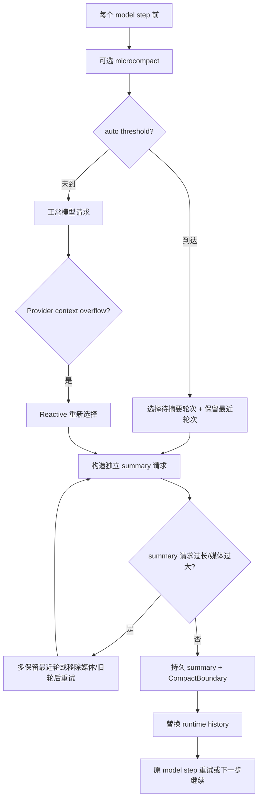

# B2：上下文压缩、历史替换与续跑

## 研究问题与边界

本专题按“触发与选取 → 摘要生成 → 历史替换 → 持久化 → 冷恢复 → 续跑”追踪完整 compact，并另行说明只清理旧工具结果的 microcompact。基线为 `872ad960de7ec172591f7e1952f7849229f94521`，未做真实长会话运行验证。

## 总体流程

## 1. 三类触发与预算

完整 compact 有 manual、auto 和 reactive 三条入口。auto 在每个模型步骤前运行；reactive 在 Provider 抛出或返回 context exceeded 后，对同一步骤最多尝试一次，然后重试模型请求。[turn-loop.ts:53-103](../../../apps/zcode-cli/packages/core/src/runtime/methods/turn-loop.ts) [turn-model-step.ts:430-439](../../../apps/zcode-cli/packages/core/src/runtime/methods/turn-model-step.ts)

默认 context window 为 200K。阈值不是直接使用完整窗口：先预留正常输出预算（最多 21K），再扣 13K buffer；达到阈值且至少有足够历史、compact 未禁用、连续失败未达到 3 次时才自动压缩。token 来源优先使用 Provider usage 基线加本地增量，否则使用估算。[policy.ts:6-151](../../../apps/zcode-cli/packages/core/src/compact/policy.ts) [compact.ts:184-306](../../../apps/zcode-cli/packages/core/src/runtime/methods/compact.ts)

rapid-refill breaker 还会阻止压缩后很快再次填满的循环，避免反复 summary 却不能释放有效空间。[turn-loop.ts:79-101](../../../apps/zcode-cli/packages/core/src/runtime/methods/turn-loop.ts)

## 2. 选取摘要区和保留区

选取先把 Context prefix 与对话 body 分开，再按 assistant-started rounds 分组。auto/reactive 默认至少保留最近一组，且至少留一组可供摘要；manual 不强制保留最近组。[compact-selection.ts:30-57](../../../apps/zcode-cli/packages/core/src/runtime/helpers/compact-selection.ts) [compact-selection.ts:211-228](../../../apps/zcode-cli/packages/core/src/runtime/helpers/compact-selection.ts)

若初次 Provider overflow 提供类似 `actual tokens > limit` 的差值，选择器估算最近各组 token，并扩大保留区以从 summary 请求中移走足够 token。summary 自身仍过长时，auto/reactive 继续增加保留组；manual 等入口可启用降级路径，按 token gap 或约 20% 从最旧组开始丢弃，并在开头需要时加入 retry marker，避免以孤立 assistant 开始。[compact-selection.ts:59-139](../../../apps/zcode-cli/packages/core/src/runtime/helpers/compact-selection.ts) [compact-selection.ts:167-205](../../../apps/zcode-cli/packages/core/src/runtime/helpers/compact-selection.ts) [compact-selection.ts:279-407](../../../apps/zcode-cli/packages/core/src/runtime/helpers/compact-selection.ts)

“保留最近组”不是删除它们：这些 entry 不进入 summary 模型请求，之后会与 summary 一起构成新 runtime history，并通过 `preservedSegment` 记录可供冷恢复重插的持久消息区间。

## 3. 摘要请求不是普通 turn

compact 创建独立 operation/timeline，快照 active entries，并用当前 session model 或显式 model。summary 请求有独立 prompt 和最大 20K 输出上限。MCP 工具数量超过阈值时，summary 请求不携带工具，避免工具 schema 本身撑爆上下文。[compact-active.ts:170-258](../../../apps/zcode-cli/packages/core/src/runtime/methods/compact-active.ts)

请求仍经过 media capability 与 media budget 投影。若媒体过大，首次失败后移除媒体重试；若 context overflow，无论表现为 throw 还是 finishReason，都走同一套扩大保留区/降级截断逻辑。[compact-active.ts:259-480](../../../apps/zcode-cli/packages/core/src/runtime/methods/compact-active.ts)

用于持久 ModelRequest 事件的 messages 会过滤一次性 Continue entry，而真实 Provider 请求可包含它；两者刻意不同。[compact-active.ts:308-409](../../../apps/zcode-cli/packages/core/src/runtime/methods/compact-active.ts)

## 4. 提交顺序：先持久事实，再替换内存历史

summary 成功后，系统生成隐藏且 Provider-visible 的 synthetic user message，并加入 post-compact reminders，例如已批准 plan 引用和需要重新读取文件的提醒。然后构造 `CompactBoundary`，其中记录 summary ID、最后被摘要消息、保留段、压缩前后 token、触发类型和是否预计下 turn 再触发。[compact-active.ts:484-573](../../../apps/zcode-cli/packages/core/src/runtime/methods/compact-active.ts)

提交顺序是：

1. 持久化 summary message、text part、compaction part 及 reminders；任一步失败都 best-effort 删除本次已写 messages。
2. 写 `CompactBoundary` event。
3. 把 timeline 标记 completed。
4. 更新 latest conversation anchor，整体替换 `messageHistory`，清空 read-file state。

对应实现位于 [compact-active.ts:575-630](../../../apps/zcode-cli/packages/core/src/runtime/methods/compact-active.ts) 和 [compact-persistence.ts:289-441](../../../apps/zcode-cli/packages/core/src/runtime/methods/compact-persistence.ts)。这种顺序避免 runtime 已切到摘要而持久事实尚未完成。

## 5. 冷恢复如何重建摘要后的消息

resume 的 active message selection 从最后一个有效 compaction boundary 开始。若 boundary 带 `preservedSegment`，hydrator 从旧 transcript 中取出指定 head/tail 区间的 user/assistant messages，插在 summary anchor 后；UI-only timeline、compaction part 和 assistant error 不参与保留。[compact-session.ts](../../../apps/zcode-cli/packages/core/src/agent/compact-session.ts)

runtime 另外计算不含 preserved segment 的 timeline active messages，用它决定最新 conversation/assistant anchor，防止被重新插入的旧消息错误地成为后续 compact parent。[resume.ts:120-168](../../../apps/zcode-cli/packages/core/src/runtime/methods/resume.ts)

进程若在 compact timeline 的 started/retrying 状态退出，恢复时检查同 operation 是否已经有 boundary：有则收敛为 completed，没有则 interrupted，并要求 V4 重新加载消息，避免首帧短暂显示旧状态。[compact-persistence.ts:200-287](../../../apps/zcode-cli/packages/core/src/runtime/methods/compact-persistence.ts) [resume.ts:110-123](../../../apps/zcode-cli/packages/core/src/runtime/methods/resume.ts)

## 6. 续跑行为

auto 成功直接把当前 `turnRequestState.entries` 替换为 compact result entries，再进行本步模型请求。reactive 成功后也替换 entries，并重建 turn machine，然后重试刚才 overflow 的模型步骤。[compact.ts:256-306](../../../apps/zcode-cli/packages/core/src/runtime/methods/compact.ts) [compact.ts:352-461](../../../apps/zcode-cli/packages/core/src/runtime/methods/compact.ts)

auto summary 自身可重试最多三次；reactive 对同一 model step 只进行一次完整 compact 尝试。取消会保持 foreground queue 的既有授权语义，失败增加 circuit-breaker 计数。[compact-active.ts:203-215](../../../apps/zcode-cli/packages/core/src/runtime/methods/compact-active.ts) [compact-active.ts:632-685](../../../apps/zcode-cli/packages/core/src/runtime/methods/compact-active.ts)

### Reactive compact 的异常因果链

Reactive 不是普通的“阈值达到就摘要”。Provider **抛出** context-exceeded 错误时，当前 assistant step 先持久化错误信息，随后进入恢复分支；Provider **返回** context-exceeded finish reason 时，若没有 tool call 且不是 output-token continuation，代码在把空响应归类为一般可疑空消息前识别超窗，避免失去恢复机会。[turn-model-step.ts:375-439](../../../apps/zcode-cli/packages/core/src/runtime/methods/turn-model-step.ts) [turn-model-step.ts:499-524](../../../apps/zcode-cli/packages/core/src/runtime/methods/turn-model-step.ts)

恢复函数先查“本 model step 是否已尝试”与 rapid-refill breaker；然后把尝试标志置位，从**当前请求 entries** 重新投影，不使用 UI rows 或整个持久 transcript。禁用 compact 或历史不足会返回 skipped；成功则用新 entries 替换本轮 request state、清除连续失败计数，并重新创建 turn machine，外层 loop 因 `continue` 重组同一步请求。若摘要失败且非取消，连续失败计数增加并把原 context error 交给上层；取消仍向外抛出。[turn-model-step.ts:742-806](../../../apps/zcode-cli/packages/core/src/runtime/methods/turn-model-step.ts) [compact.ts:352-467](../../../apps/zcode-cli/packages/core/src/runtime/methods/compact.ts)

这里有两个重试单位：summary 请求内部遇到媒体过大或 prompt too long，会剥离媒体、扩大保留区或走允许的降级选取；只有 **Auto** compact 对整个 summary 操作进行最多三次外层重试。Reactive 在同一 model step 只做一次完整 compact，然后重试原模型步骤，并非反复摘要直到成功。[compact-active.ts:267-480](../../../apps/zcode-cli/packages/core/src/runtime/methods/compact-active.ts) [compact-active.ts:630-685](../../../apps/zcode-cli/packages/core/src/runtime/methods/compact-active.ts)

设计推断：先关闭当前失败 step，再显式替换请求历史和 turn machine，可避免把“Provider 已拒绝的请求”当成成功模型步骤继续消费。代价是必须区分原请求、summary 请求和重试请求的身份；仅在异常处理器里缩短消息数组而不重建状态机，容易留下错误的 step 状态。

## 7. Microcompact：局部清理旧工具结果

microcompact 默认未启用，只有 `compact.microcompact.enabled === true` 才运行。启用后，它在完整 compact 前按时间空闲或 token 压力触发；默认阈值是完整 compact 阈值的 90% 与“提前 2K”两者中的较小值。[microcompact.ts:24-115](../../../apps/zcode-cli/packages/core/src/runtime/methods/microcompact.ts) [microcompact.ts:77-194](../../../apps/zcode-cli/packages/core/src/compact/microcompact.ts)

候选仅限配置允许的工具结果，默认保留最近 5 个 assistant tool-call groups，不清错误结果、不清 image/video/file 媒体，并要求至少节省 256 tokens。旧结果内容替换为固定标记 `[Old tool result content cleared]`，tool call 配对和顺序仍保留。[microcompact.ts:12-28](../../../apps/zcode-cli/packages/core/src/compact/microcompact.ts) [microcompact.ts:197-256](../../../apps/zcode-cli/packages/core/src/compact/microcompact.ts)

应用后同时替换 canonical runtime history 与当前 request entries，并写 `MicrocompactBoundary` event。[runtime microcompact.ts:73-102](../../../apps/zcode-cli/packages/core/src/runtime/methods/microcompact.ts) 目前读到的 cold hydration 从 Session messages 重建，未发现它回放该 event 来永久改写历史工具结果；因此更准确的结论是“microcompact 的内容替换是 runtime 局部优化，事件提供记录，重启后可在下次 loop 再次触发”，而非宣称原 transcript 已被重写。这一点尚未运行验证。

### 假设示例：压缩后的请求

假设历史为 Prefix + R1 + R2 + R3，auto 选择保留 R3。summary 请求接收 Prefix + R1 + R2；成功后新的 runtime history 为 Prefix + Summary + R3 + reminders。冷恢复从 boundary 找到 Summary，再按 preserved segment 将 R3 插回。该示例仅用于解释选择和重建，不代表真实 token 数或实际运行结果。

## 设计取舍与迁移条件

以下为研究者推断：ZCode 同时保留“语义摘要”和“最近原文”，减少摘要丢失刚发生工具状态的风险；用 boundary 而不是物理删除旧 transcript 支持恢复、分叉和审计。代价是 active branch、timeline anchor 和 Provider history 不再是一条简单消息数组。迁移时必须同时实现持久 boundary、runtime replace、cold selection 和 retry semantics；只在内存里把 messages 替换为 summary 会在重启后复活旧上下文。

## 验证与未知

- 已静态闭合 proactive/reactive/manual、selection、summary request、持久化、runtime replace 和 cold recovery。
- 未执行长上下文、媒体超限、summary 超限、进程中断或 rapid-refill 场景。
- Microcompact event 是否有仓库外消费者、Provider usage 在各种 adapter 上是否稳定，仍为有边界未知。
