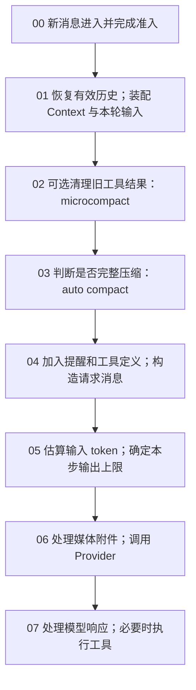

# B5：上下文管理的完整模型

## 一条消息经过上下文系统的路径

**阅读方向：从上往下，按 00 → 07。** 图只画一条主线；每个分支的判断标准、动作和下一站列在图下方。`02` 到 `07` 是一个 **model step**，同一用户消息可能因工具结果或续写多次回到 `02`。基线：`872ad960de7ec172591f7e1952f7849229f94521`。

**分支读法：**先按编号往下；遇到下表的条件，执行该行「动作」，再按「下一站」继续。`T` 指 auto compact 的输入 token 阈值，不是所有资源共用的阈值。

| 步骤 | 判断标准 | 动作与下一站 |
| --- | --- | --- |
| 01 | Runtime 是否需要冷恢复；本轮输入是否引用 `#sess_*` | 若需恢复，先从 Session 消息与 compact boundary 重建有效历史；随后加入新输入。Skills metadata 与 Memory 索引属于运行时上下文初始化。引用其他 Session 只附加提示，不自动导入其 transcript；若模型需要，会在 07b 调用 `ReadSessionContext`。→ 02 |
| 02 | `compact.microcompact.enabled === true`，且空闲超过默认 60 分钟或估算 token 达到 microcompact 阈值。默认阈值为 `max(0, min(floor(T × 0.9), T - 2K))`；另须有合格旧工具结果、保留最近默认 5 组、预计至少节省 256 token | 替换符合条件的旧工具结果；否则原样继续。→ 03 |
| 03 | auto compact 启用、有可摘要历史、连续失败未达默认 3 次，且 `tokenCount >= T`。默认 `T = max(0, contextWindow - min(maxOutputTokens, 21K) - 13K)`；窗口未知按 200K | 达标时选历史、摘要、持久化 boundary 并替换当前历史。成功或非取消失败都继续 → 04；rapid-refill breaker 触发则报错，取消则结束。 |
| 05 | `contextWindow - estimatedInput - 1K > 0` | 输出上限取模型上限与该剩余值的较小值；否则保留模型上限，交由 Provider/后续恢复路径判定。→ 06 |
| 06 | 媒体编码字节总量是否超过默认 40 MiB | 未超限 → Provider；超限但本轮真实用户媒体可保留 → 旧媒体按最近优先保留，其余变占位文本；仅本轮媒体已超限 → 附件错误，不进入 reactive compact。 |
| 07a | Provider 抛出 context-exceeded；或在无 tool call、无输出续写的分支返回相应 finish reason | 同一 model step 最多尝试一次 reactive compact；成功后回到 **02** 重建请求；失败、跳过则保留原错误，取消则结束。 |
| 07b | Provider 返回工具调用 | 各工具先处理原始输出，通用结果序列化再按各工具预算截断/落盘；结果提交到请求历史后回到 **02**。已追踪的批量汇合代码没有统一的「并发总结果 token 闸门」。 |
| 07c | Provider 达到输出 token 上限且允许续写 | 追加一次性续写输入，回到 **02**；若无法继续则返回输出上限错误。 |
| 07d | 没有待执行工具、续写或恢复分支 | 正常结束本轮。 |

[turn.ts:477-614](../../../apps/zcode-cli/packages/core/src/runtime/methods/turn.ts) [turn-loop.ts:47-213](../../../apps/zcode-cli/packages/core/src/runtime/methods/turn-loop.ts) [runtime microcompact.ts:24-115](../../../apps/zcode-cli/packages/core/src/runtime/methods/microcompact.ts) [compact/microcompact.ts:77-195](../../../apps/zcode-cli/packages/core/src/compact/microcompact.ts) [policy.ts:67-155](../../../apps/zcode-cli/packages/core/src/compact/policy.ts) [model-token-limits.ts:17-40](../../../apps/zcode-cli/packages/core/src/runtime/methods/model-token-limits.ts) [media-budget.ts:75-150](../../../apps/zcode-cli/packages/core/src/runtime/helpers/media-budget.ts) [turn-model-step.ts:647-664](../../../apps/zcode-cli/packages/core/src/runtime/methods/turn-model-step.ts) [turn-tools.ts:235-269](../../../apps/zcode-cli/packages/core/src/runtime/methods/turn-tools.ts)

这里把分支标准放在编号旁，后文再分别展开内部流程。特别注意：auto compact 在 **03**、普通请求输出预算在 **05**、媒体字节预算在 **06**，三者单位和失败策略不同。完整压缩细节见 [B2](b-compaction.md)，工具结果细节见 [B4](b-large-tool-results.md)。阅读时还须区分持久 Session 消息、运行时历史、当前 request entries、最终 Provider 请求和 UI 展示。

## 00–01. 一条新输入从哪里取得历史：冷恢复与 Context 初始化

这里的**冷恢复**有明确的运行时含义：协议层的 resident registry 里已没有这个 Session 的可执行 runtime，但 Session Store 仍有持久化记录。再次访问该 session 时，`activateSessionForResume` 先等待可能正在进行的去激活；若 registry 已有 record，直接复用；否则读取持久 Session，创建 record，调用 `app.resume()` / `resumeFromStore`。显式 `session/resume` 会走这条路径，V4 冷订阅也能先激活 runtime，再做自己的持久投影。进程重启后再次打开持久会话也属于同一类。它**不是** Provider prompt cache 过期，也不是每次新消息都重新读全库。[server-operations.ts:1402-1522](../../../apps/zcode-cli/packages/bootstrap/src/zcode-protocol/server-operations.ts)

为什么 runtime 会不常驻？常驻池默认目标 8、最高水位 16，候选连续空闲默认 10 分钟可因 idle timeout 去激活；超过高水位时可按 LRU 向目标数回收。只有已持久化、没有运行中工作/排队命令/交互/订阅/operation lease 的 Session 才可回收。去激活删除 resident record、关闭 app 并清理内存 event store，**不删除**持久 Session。故“过了 10 分钟就必定冷恢复”也不准确：必须先满足回收资格且确实发生去激活。[session-resident-pool.ts:7-11](../../../apps/zcode-cli/packages/bootstrap/src/zcode-protocol/session-resident-pool.ts) [session-resident-pool.ts:147-215](../../../apps/zcode-cli/packages/bootstrap/src/zcode-protocol/session-resident-pool.ts) [session-resident-pool.ts:226-260](../../../apps/zcode-cli/packages/bootstrap/src/zcode-protocol/session-resident-pool.ts) [session-residency.ts:45-67](../../../apps/zcode-cli/packages/bootstrap/src/zcode-protocol/session-residency.ts)

恢复不是把数据库消息原样拼成一个字符串。`resumeFromStore` 读取 Session 与消息，恢复工作目录、任务类型、workspace identity、环境和 shell 选择；重置旧 Runtime `MessageHistory` 与 ContextBuilder，先从持久记录 hydrate read-file state，再重新解析上下文来源、发现 Skills、加载当前 `MEMORY.md` 索引。接着修复未完成的 compact timeline，再根据分支/rewind 和最后有效 compact boundary 选择模型有效历史并 hydrate。assistant/tool parts 会还原成模型消息；未完成的工具调用变为 *interrupted* 工具结果，不会擅自重放工具。started/retrying 的 compact timeline 若已有 boundary 则收敛为 completed，否则收敛为 interrupted。最后恢复 mode/执行状态、权限、Todo、目标状态，并运行 `SessionStart(source="resume")` hook；目标状态另作为运行时提醒注入。[resume.ts:91-179](../../../apps/zcode-cli/packages/core/src/runtime/methods/resume.ts) [resume.ts:191-262](../../../apps/zcode-cli/packages/core/src/runtime/methods/resume.ts) [session-history-hydrator.ts:54-199](../../../apps/zcode-cli/packages/core/src/agent/session-history-hydrator.ts) [compact-persistence.ts:200-287](../../../apps/zcode-cli/packages/core/src/runtime/methods/compact-persistence.ts)

Context 初始化从 `ContextSourcePort` 得到指令/环境快照，并加载 Skill catalog、Memory root 和索引；随后 ContextBuilder 生成 system 与 meta-user 前缀。Memory 正文没有在每条消息开始时做语义检索：自动进入前缀的是索引（最多 200 行、25,000 字符），详情靠模型后续 Read/Grep/Glob。已运行的同一 runtime 复用 `memoryIndexContent` 快照；重新初始化/冷恢复才自然重新读取磁盘索引。每个新 turn 可从已有快照重建模型相关前缀，但不是重新扫描 Memory 文件。[context.ts:35-73](../../../apps/zcode-cli/packages/core/src/runtime/methods/context.ts) [context.ts:168-195](../../../apps/zcode-cli/packages/core/src/runtime/methods/context.ts) [request-user-context.ts:47-76](../../../apps/zcode-cli/packages/core/src/context/sections/request-user-context.ts) [index-content.ts:13-37](../../../apps/zcode-cli/packages/core/src/memory/index-content.ts) [context-refresh.ts:7-54](../../../apps/zcode-cli/packages/core/src/runtime/methods/context-refresh.ts)

**这里有两种容易混称的“Session memory”。**其一是当前 Session 的持久消息：它供冷恢复和完整 compact 的有效历史选择使用，不是每轮自动向模型灌入全部旧 transcript。其二是**跨 Session 按需读取**：真实用户输入出现 `#sess_*` 时，只附加一个提醒，明确旧会话不会自动展开；模型确需背景时，调用 `ReadSessionContext(sessionId, query, strategy)`。该工具读取另一会话的持久 Session 消息、先按有效分支/compact boundary 选取可读内容，再按 query 与字符预算选片段；有模型时可用单独的轻量提取请求，失败则回退本地选段。工具结果作为当前会话的一次 tool result 进入后续上下文，不等于本会话 `/resume`，也不是自动语义检索全部历史。[references.ts:5-27](../../../apps/zcode-cli/packages/core/src/session-context/references.ts) [turn.ts:863-872](../../../apps/zcode-cli/packages/core/src/runtime/methods/turn.ts) [read-session-context.ts:38-143](../../../apps/zcode-cli/packages/core/src/tool/handlers/read-session-context.ts) [session-context/read-session-context.ts:54-100](../../../apps/zcode-cli/packages/core/src/session-context/read-session-context.ts)

第三种是**Project Memory**：启用时跨会话共享同一 workspace identity 下的事实文件，初始化自动加载 `MEMORY.md` 索引，详情按需 Read；成功 turn 后可从 durable Session 快照后台提取更新。Subagent profile 还有独立 persistent memory 作用域。它们都不同于 `CompactTrigger.SessionMemory` 这个契约枚举：当前核心运行时检索到它用于 compact phase/reason 的分支映射，未找到发起该 trigger 的调用，故不能据枚举断言存在已启用的 Session-memory compact 流程。[project-memory.ts:5-28](../../../apps/zcode-cli/packages/core/src/runtime/helpers/project-memory.ts) [project-memory-extraction.ts:32-80](../../../apps/zcode-cli/packages/core/src/runtime/helpers/project-memory-extraction.ts) [runtime compact.ts:40-63](../../../apps/zcode-cli/packages/core/src/runtime/helpers/compact.ts) [subagent/persistent-memory.ts:70-100](../../../apps/zcode-cli/packages/core/src/subagent/persistent-memory.ts)；项目记忆详见 [B3](b-memory.md)。

新用户输入随后被写入运行时历史与 Session；当前 turn 从 `MessageHistory` 复制 `request entries`。这解释了为何后面的压缩要同时处理 canonical runtime history 和本轮请求副本。持久消息、运行时 entries、Provider 投影、UI 行仍是不同表示。[turn.ts:477-529](../../../apps/zcode-cli/packages/core/src/runtime/methods/turn.ts) [turn.ts:595-614](../../../apps/zcode-cli/packages/core/src/runtime/methods/turn.ts)

## 02. Microcompact：只清旧工具结果，不生成摘要

**触发。**总 compact 被禁用时直接跳过；microcompact 本身默认关闭，需显式 `compact.microcompact.enabled === true`。开启后每个 model step 前检查：上次 assistant 完成后空闲超过默认 60 分钟，**或**投影后的估算 token 达到 `M = max(0, min(floor(T × 0.9), T − 2,000))`（`T` 是完整 auto compact 阈值）。时间与 token 只是触发尝试；没有合格候选时仍不改变历史。[runtime microcompact.ts:24-56](../../../apps/zcode-cli/packages/core/src/runtime/methods/microcompact.ts) [runtime microcompact.ts:105-115](../../../apps/zcode-cli/packages/core/src/runtime/methods/microcompact.ts) [compact/microcompact.ts:12-24](../../../apps/zcode-cli/packages/core/src/compact/microcompact.ts) [compact/microcompact.ts:77-113](../../../apps/zcode-cli/packages/core/src/compact/microcompact.ts) [compact/microcompact.ts:171-195](../../../apps/zcode-cli/packages/core/src/compact/microcompact.ts)

**选什么。**先把 runtime entries 投影为模型消息，再按 assistant 的 tool-call 批次收集合格 tool result。默认仅 Read、Bash、Grep、Glob、WebFetch、WebSearch、Edit、Write、ApplyPatch；默认不清错误、已经清过的结果以及含 image/video/file 的结果。保留最近 5 个合格组，只清更旧的组；预计节省不足 256 token 也放弃。这里的“5 组”是 assistant tool-call groups，不是最后 5 个字节块或 5 条任意消息。[runtime compact.ts:90-150](../../../apps/zcode-cli/packages/core/src/runtime/helpers/compact.ts) [compact/microcompact.ts:115-168](../../../apps/zcode-cli/packages/core/src/compact/microcompact.ts) [compact/microcompact.ts:197-256](../../../apps/zcode-cli/packages/core/src/compact/microcompact.ts)

**做什么、改哪层。**把所选 tool result 的模型可见内容换成固定文本 `[Old tool result content cleared]`，保留 tool-call ID、配对关系、顺序和其他消息；以 copy-on-write 更新 canonical 运行时 `MessageHistory` **和**本轮 `request entries`。所以它不只是一次 Provider 请求的临时投影：同一 runtime 后续 model step 也会继续看到清理后的内容。源码还追加 `MicrocompactBoundary` event，但默认 `eventStore` 是内存存储，`persistDurableSessionEvent` 没有这个事件的 SessionStore 分支。原始 Session tool part 的 `output`/媒体记录不被回写或删除，UI 的权威 transcript 也不因这一步缩短。它不生成摘要，也没有凭占位文字找回原结果的机制。[runtime microcompact.ts:73-102](../../../apps/zcode-cli/packages/core/src/runtime/methods/microcompact.ts) [turn-tools.ts:286-345](../../../apps/zcode-cli/packages/core/src/runtime/methods/turn-tools.ts) [events.ts:81-108](../../../apps/zcode-cli/packages/core/src/runtime/methods/events.ts) [events.ts:263-280](../../../apps/zcode-cli/packages/core/src/runtime/methods/events.ts) [events.ts:420-423](../../../apps/zcode-cli/packages/core/src/runtime/methods/events.ts) [create-app.ts:727-731](../../../apps/zcode-cli/packages/bootstrap/src/app/create-app.ts)

**冷恢复与 JSONL 不是同一件事。**`resumeFromStore` 从 SessionStore 读持久消息，hydrator 对 completed tool part 读取原 `output` 或持久媒体，当前路径没有重放 microcompact boundary 来再清旧结果；如果完整 compact 已提交，仍须先按最后有效 compact boundary 选历史，不能因此说“所有 microcompact 前工具结果必定回来”。ZCode 默认 SessionStore 是 SQLite；另有 `model-io-<session>.jsonl` 诊断请求/响应，它可能记录某次清理前的请求，也会记录清理后的请求。默认诊断模式按 delta/tail、大小上限、轮转和脱敏规则保存；显式全量保留模式跳过容量/缩减规则，但仍不是 Session 冷恢复源。不能用“JSONL 还在”保证原工具结果可恢复。若后续完整 compact 摘要基于已清理的运行时历史生成，清除还可能**间接影响持久化摘要**，虽不改变原 tool part。[resume.ts:91-174](../../../apps/zcode-cli/packages/core/src/runtime/methods/resume.ts) [session-history-hydrator.ts:149-178](../../../apps/zcode-cli/packages/core/src/agent/session-history-hydrator.ts) [session-store.ts:1-6](../../../apps/zcode-cli/packages/adapters/src/storage/session-store.ts) [runner-debug.ts:34-46](../../../apps/zcode-cli/packages/adapters/src/model/runner-debug.ts) [runner-debug.ts:470-535](../../../apps/zcode-cli/packages/adapters/src/model/runner-debug.ts) [runner-debug.ts:627-755](../../../apps/zcode-cli/packages/adapters/src/model/runner-debug.ts)

**示例（假设输入，不是运行记录）：**历史里有 8 个合格 tool-call 组；在启用且触发后，前 3 组的文本结果被替成标记，后 5 组原样保留。如果前 3 组都是很短的输出、节省不足 256 token，则 8 组全部保持原样。压缩完仍进入步骤 03；microcompact 并不保证把输入压到完整 compact 阈值以下。

## 03. Auto compact：判定、摘要、替换和冷重建

**先估算，再决定。**`turn-loop` 在 02 后调用 `autoCompactIfNeeded`。它把当前 `request entries` 投影成 Provider 消息，优先用最近已提交 assistant 的 Provider usage 作为基线，加上此后消息的本地估算；没有可用基线时估算整个投影。默认窗口未知按 200K；`T = max(0, contextWindow − min(modelMaxOutputTokens 或默认 32K, 21K) − 13K)`。禁用、可摘要历史不足、连续失败达到默认 3 次或估算未到 `T` 时跳过；达标后另检查 rapid-refill breaker，避免刚压缩后立刻反复压缩。[turn-loop.ts:67-103](../../../apps/zcode-cli/packages/core/src/runtime/methods/turn-loop.ts) [compact.ts:184-245](../../../apps/zcode-cli/packages/core/src/runtime/methods/compact.ts) [compact.ts:313-349](../../../apps/zcode-cli/packages/core/src/runtime/methods/compact.ts) [policy.ts:67-155](../../../apps/zcode-cli/packages/core/src/compact/policy.ts)

**摘要前如何处理消息。**先复制 active entries（依赖 entry 不可变约定），把 Context 前缀和会话正文分开；正文按“assistant 开始的轮次”分组。auto/reactive 默认保留最近至少一组原文，同时至少留一组可摘要；更早各组连同 Context 前缀组成独立 summary 请求。前缀给摘要模型作背景，但 `summarizedMessageCount` 不把它当成被摘要的对话正文。不是对每条 msg 预先做统一截断。若原请求已被 Provider 报超窗且错误给出 token 差额，reactive 入口可先扩大最近保留区，使 summary 请求少带几组；summary 自己超窗时继续扩大保留区。[compact-active.ts:180-238](../../../apps/zcode-cli/packages/core/src/runtime/methods/compact-active.ts) [compact-selection.ts:30-57](../../../apps/zcode-cli/packages/core/src/runtime/helpers/compact-selection.ts) [compact-selection.ts:103-165](../../../apps/zcode-cli/packages/core/src/runtime/helpers/compact-selection.ts)

**压缩 Prompt 在哪里。**完整模板在 [`compact/prompt.ts`](../../../apps/zcode-cli/packages/core/src/compact/prompt.ts)：要求模型按时间梳理用户意图、已采取动作、技术细节、错误与反馈、当前工作和下一步，以 `<analysis>` 与 `
` 格式输出；前后都强调仅返回文本、不要调用工具。`buildCompactSummaryRequestMessages` 把选中历史加上该 Prompt 作为最后一条 user 消息，再做 Provider 投影和媒体能力/字节预算。摘要请求输出最多 20K；工具目录超过 100 个时不传工具。即使工具可见，模型若真的返回 tool call，代码也拒绝把它当成有效摘要。auto 不传自定义压缩指令；手动 `/compact` 可以追加 custom instructions。[prompt.ts:1-116](../../../apps/zcode-cli/packages/core/src/compact/prompt.ts) [compact-active-helpers.ts:80-120](../../../apps/zcode-cli/packages/core/src/runtime/methods/compact-active-helpers.ts) [compact-active.ts:251-268](../../../apps/zcode-cli/packages/core/src/runtime/methods/compact-active.ts) [compact-active.ts:308-416](../../../apps/zcode-cli/packages/core/src/runtime/methods/compact-active.ts) [compact-active.ts:716-725](../../../apps/zcode-cli/packages/core/src/runtime/methods/compact-active.ts)

**摘要请求异常。**摘要模型若遇媒体过大，第一次失败后剥离媒体重试；若抛 context-exceeded 或以 finish reason 表示超窗，尝试把更多最近组移出 summary 请求，作为原文保留。对 auto/reactive，源码不启用“再丢弃最旧组”的 summary 截断兜底；该兜底属于其他触发类型。auto 对可重试的整个摘要操作最多 3 次，reactive 的完整 compact 只尝试一次；取消直接传播。摘要失败时 auto 记录失败后继续用原历史尝试普通请求，reactive 失败则保留原超窗错误。[compact-active.ts:267-305](../../../apps/zcode-cli/packages/core/src/runtime/methods/compact-active.ts) [compact-active.ts:417-480](../../../apps/zcode-cli/packages/core/src/runtime/methods/compact-active.ts) [compact-active.ts:632-690](../../../apps/zcode-cli/packages/core/src/runtime/methods/compact-active.ts) [compact.ts:257-310](../../../apps/zcode-cli/packages/core/src/runtime/methods/compact.ts) [compact.ts:410-461](../../../apps/zcode-cli/packages/core/src/runtime/methods/compact.ts)

**摘要成功后的请求历史。**模型返回的 `<analysis>` 被移除，`
` 被整理为 `Summary:`；代码生成一条隐藏于 UI、但模型可见的 synthetic user summary。新 runtime entries 是 `当前 Context 前缀 + summary + 最近保留原文 + 后置提醒`，并非重新打开所有文件或重播全部工具。最近保留组里的 assistant usage 被失效化，避免旧 usage 继续当新请求的 token 基线。摘要本身是有损的；recent group 才是逐条原文保留。此调用没有给 summary message 传 `transcriptPath`，因此虽然旧消息仍在 Session Store，当前模型不会因此自动得到完整旧 transcript 的读取路径。[prompt.ts:119-165](../../../apps/zcode-cli/packages/core/src/compact/prompt.ts) [runtime compact.ts:72-87](../../../apps/zcode-cli/packages/core/src/runtime/helpers/compact.ts) [runtime compact.ts:157-166](../../../apps/zcode-cli/packages/core/src/runtime/helpers/compact.ts) [compact-active.ts:517-548](../../../apps/zcode-cli/packages/core/src/runtime/methods/compact-active.ts)

**哪些东西单独保留或重新注入？**下表把“模型能否继续看到”与“底层事实是否还在”分开：

| 对象 | compact 当下 | 之后冷恢复 / 限制 |
| --- | --- | --- |
| Session transcript | 旧消息不物理删除；写 summary message、`CompactBoundary`、后置提醒，随后替换 runtime history | `activeSessionMessages` 从最后有效 boundary 选历史，并按 `preservedSegment` 的 head/tail ID 插回最近保留消息；旧全文仍在 store，不等于自动回到模型上下文。[compact-active.ts:549-625](../../../apps/zcode-cli/packages/core/src/runtime/methods/compact-active.ts) [compact-session.ts:4-46](../../../apps/zcode-cli/packages/core/src/agent/compact-session.ts) |
| 已读文件内容 | 从 `readFileState` 选最近最多 5 个合格 Read；单文件约 5K token 内可重新注入带行号内容，过大或总预算不足则只注入路径和“可再 Read”提示；保留段已含该 Read 时跳过 | 后置提醒随 summary 一起持久化；提交后 runtime `readFileState.clear()`。文件本身仍在工作区，但不是无损重灌所有已读文件。[compact-post-reminders.ts:8-66](../../../apps/zcode-cli/packages/core/src/runtime/helpers/compact-post-reminders.ts) [compact-active.ts:484-501](../../../apps/zcode-cli/packages/core/src/runtime/methods/compact-active.ts) [compact-active.ts:615-625](../../../apps/zcode-cli/packages/core/src/runtime/methods/compact-active.ts) |
| 已批准 Plan | 若 Session 对应 plan 文件存在，读出并生成 `plan_file_reference` 后置提醒 | 提醒持久化，可在冷恢复中还原；文件读取有字节上限，缺失则不注入。不是所有规划内容都自动保存成 plan 文件。[plan-file-continuity.ts:59-101](../../../apps/zcode-cli/packages/core/src/runtime/helpers/plan-file-continuity.ts) |
| Todo 与长期目标 | Todo 不靠摘要作唯一备份：`TodoWrite` 更新 Session Store；目标也有独立 Session 存储。普通 step 仅在 Todo reminder 条件满足时读取并注入当前列表 | cold resume 分别读取 Todos/target；目标状态明确注入运行时历史。Todo reminder 是条件性提醒（默认距上次写入和上次提醒各至少 10 个 assistant turns），不是每轮必有。[todo.ts:47-71](../../../apps/zcode-cli/packages/core/src/tool/handlers/todo.ts) [turn-loop.ts:138-155](../../../apps/zcode-cli/packages/core/src/runtime/methods/turn-loop.ts) [runtime-reminders.ts:81-84](../../../apps/zcode-cli/packages/core/src/runtime/helpers/runtime-reminders.ts) [runtime-reminders.ts:163-179](../../../apps/zcode-cli/packages/core/src/runtime/helpers/runtime-reminders.ts) [resume.ts:233-262](../../../apps/zcode-cli/packages/core/src/runtime/methods/resume.ts) |
| Skills 与 Memory | Skills catalog 和 Memory 索引属于 Context 前缀，随前缀保留；已调用 `Skill` 得到的正文是工具结果，进入摘要区时由模型概括，落在最近保留组才逐字保留 | cold resume 重新发现 Skills、重读 Memory 索引；`Skill` 正文可再次调用工具从磁盘加载，Memory 详情可 Read。未发现“当前执行 Skill”的独立运行时栈或无损重注入步骤，不能把 catalog 可用误说成旧正文仍在上下文。[context.ts:35-73](../../../apps/zcode-cli/packages/core/src/runtime/methods/context.ts) [skill.ts:16-70](../../../apps/zcode-cli/packages/core/src/tool/handlers/skill.ts) [request-user-context.ts:47-76](../../../apps/zcode-cli/packages/core/src/context/sections/request-user-context.ts) |
| Plugin 引用与 Hook 追加内容 | `plugin_reference` reminder 由真实用户输入解析，匹配当时 live catalog 后写为 model-only synthetic Session 消息；旧引用是否进 summary 或最近原文由位置决定。Hook additional context 是 runtime attachment，也受同样的摘要/保留选择 | plugin reminder 若仍属有效历史可 hydration；新 turn 仅对新的真实引用重新解析。`SessionStart` hook 在新 runtime 的 resume 路径运行；同一 runtime 有 once 标志，auto compact 不会凭空重新运行所有 hook。`UserPromptSubmit` 旧输出没有独立“无损恢复”为当前提醒的证据。[plugin-reference.ts:80-149](../../../apps/zcode-cli/packages/core/src/runtime/methods/plugin-reference.ts) [hooks.ts:20-47](../../../apps/zcode-cli/packages/core/src/runtime/methods/hooks.ts) [hooks.ts:106-117](../../../apps/zcode-cli/packages/core/src/runtime/methods/hooks.ts) [resume.ts:254-262](../../../apps/zcode-cli/packages/core/src/runtime/methods/resume.ts) |

**持久提交与冷重建顺序。**先持久化 summary text/compaction part 和后置提醒；再写 boundary event、completed timeline；最后替换 runtime `MessageHistory` 并清 read-file state。持久化提醒任一步失败会 best-effort 回滚本次消息。冷恢复选择最后有效 boundary，插回 boundary 记载的最近保留段；若进程在 compact started/retrying 时退出，有 boundary 则修复为 completed，没有则 interrupted。这里的“恢复上下文”是按持久结构**重建新的模型有效视图**，不是把压缩前所有信息无损解压回来。[compact-active.ts:575-630](../../../apps/zcode-cli/packages/core/src/runtime/methods/compact-active.ts) [compact-persistence.ts:289-381](../../../apps/zcode-cli/packages/core/src/runtime/methods/compact-persistence.ts) [resume.ts:147-179](../../../apps/zcode-cli/packages/core/src/runtime/methods/resume.ts)

**Memory 与 compact 不是同一条备份链。**项目 Memory 文件是独立的持久事实；成功 turn 结束后可另行调度后台提取，从 durable conversation 快照提炼并更新 Memory。`compactActiveConversation` 本身不把 summary 自动当成新的 Memory 文件；冷恢复只是重新读取现有索引，详情仍按需访问。摘要 Prompt 中“保留约束、错误与用户反馈”的要求属于模型生成目标，不能当作字节级保真承诺。[turn.ts:688-703](../../../apps/zcode-cli/packages/core/src/runtime/methods/turn.ts) [project-memory-extraction.ts:32-80](../../../apps/zcode-cli/packages/core/src/runtime/helpers/project-memory-extraction.ts) [context.ts:60-72](../../../apps/zcode-cli/packages/core/src/runtime/methods/context.ts) [prompt.ts:14-43](../../../apps/zcode-cli/packages/core/src/compact/prompt.ts)

**“正在执行 Skill”还要区分两种状态。**如果 Skill 工具已经返回，正文只是历史中的一条 tool result：它可能进入摘要、最近保留组，或因 microcompact 被清理。如果进程在工具仍处于 pending/running 时消失，冷恢复会给该 tool call 放入 interrupted 结果，不会从调用中间继续执行；后续是否重新调用 Skill 由新的模型步骤决定。源码中没有把 Skill 当成可 checkpoint/restore 的独立解释器或指令栈。[skill.ts:18-70](../../../apps/zcode-cli/packages/core/src/tool/handlers/skill.ts) [session-history-hydrator.ts:149-190](../../../apps/zcode-cli/packages/core/src/agent/session-history-hydrator.ts)

## 04. 动态请求装配：哪些内容此刻真正可见

前面的 03 结束后，loop 才初始化 MCP、按当前执行状态筛选工具，并视条件追加 plan/mode/Todo/output-style 等提醒；然后从本轮 entries 构造 Provider-neutral 消息，调整 attachment 顺序和 cache marker。工具定义在请求 `tools` 字段，不能把其 token 成本当成一段普通 system 文本。模型可见消息与用于记录的 `ModelRequest` 投影还可能不同：一次性 output-token continuation 会进入真实请求，却从记录投影过滤。[turn-loop.ts:105-213](../../../apps/zcode-cli/packages/core/src/runtime/methods/turn-loop.ts) [provider-request-messages.ts:286-334](../../../apps/zcode-cli/packages/core/src/runtime/helpers/provider-request-messages.ts)

Memory 的常驻部分是索引而非自动检索出来的正文；`Skill` 目录信息是 catalog 而非全部 SKILL.md；Plugin 引用提醒只在用户确实提交引用且能与 live 能力交集匹配时出现。一次消息最终看到的内容取决于这几条路径和前面的 compact 结果，不宜用“系统把所有资料拼接后裁剪”概括。[context.ts:60-72](../../../apps/zcode-cli/packages/core/src/runtime/methods/context.ts) [skill.ts:36-70](../../../apps/zcode-cli/packages/core/src/tool/handlers/skill.ts) [plugin-reference.ts:80-131](../../../apps/zcode-cli/packages/core/src/runtime/methods/plugin-reference.ts)

## 05. 为什么压缩后还要估算 token

这里是**两次不同决策**，不是 03 没有估算。03 在当前历史上估算输入压力，问题是“要不要花一个独立模型请求生成摘要”；05 在 **03 可能已经替换过的当前请求** 上再次估算，问题是“本次普通模型请求最多允许输出多少 token”。此外 04 又可能追加提醒与工具可见能力，所以 03 的旧数字不能直接作为 05 的新请求预算。两次都优先利用已提交 assistant 的 Provider usage 基线加本地增量，否则退回本地估算；估算不等于最终 Provider tokenizer。[compact.ts:201-214](../../../apps/zcode-cli/packages/core/src/runtime/methods/compact.ts) [compact.ts:313-349](../../../apps/zcode-cli/packages/core/src/runtime/methods/compact.ts) [turn-loop.ts:105-213](../../../apps/zcode-cli/packages/core/src/runtime/methods/turn-loop.ts) [turn-model-step.ts:230-250](../../../apps/zcode-cli/packages/core/src/runtime/methods/turn-model-step.ts)

05 的公式是：模型声明的输出上限（未声明时 32K）与 `contextWindow − estimatedCurrentInput − 1K` 取较小正值；若估算剩余非正数，保留模型 baseline 上限，让 Provider 错误触发后续恢复，而不是把启发式估算当作本地硬拒绝。03 的阈值则预留至多 21K 输出和默认 13K buffer，目的不同。[model-token-limits.ts:5-40](../../../apps/zcode-cli/packages/core/src/runtime/methods/model-token-limits.ts) [policy.ts:67-87](../../../apps/zcode-cli/packages/core/src/compact/policy.ts)

**数字例子（假设模型窗口 200K、输出上限 32K）：**03 的默认 auto 阈值为 `200K − 21K − 13K = 166K`。旧历史估算 170K 且可摘要，先 compact；假设新历史变 60K，05 再算可用输出为 `min(32K, 200K − 60K − 1K) = 32K`。若 compact 因历史不足而未运行，输入估算 190K，则 05 上限约 9K。若估算已超过窗口，代码不会因该估算直接停止，而由 Provider 的真实超窗反馈决定是否走 reactive 分支。以上数字仅说明代码公式，未运行 Provider。

## 06–07. 媒体、工具结果与异常如何回到下一步

06 在 `runModelTextRequest` 中依次解析附件路径、按模型输入能力投影，再对本次请求所有媒体按**编码后字节**施加默认 40 MiB 聚合预算。若超限，保护最新真实用户消息的媒体，历史媒体按最近优先保留，丢弃的旧块变文字占位；若最新用户媒体自己已超限，直接抛当前附件过大错误。这是请求投影，不改 Session transcript，也不能靠摘要旧消息解决单个新附件过大。[model.ts:36-77](../../../apps/zcode-cli/packages/core/src/runtime/methods/model.ts) [media-budget.ts:75-150](../../../apps/zcode-cli/packages/core/src/runtime/helpers/media-budget.ts)

07 收到工具调用时，工具调度可并发，但返回结果按 tool-call ID 汇合并按原调用顺序提交。每个工具可能先在自己的适配器层限制原始输出；之后通用 `resultBudget` 默认按 UTF-8 字节给模型可见内容 100,000 bytes 上限并截断，显式启用 artifact 策略的工具才会将那一层的完整可见内容外置。以 Bash 为例，它在更早的进程采集层给 inline 内容 30,000 bytes 上限、持久文件最多 5 GiB：前台超 inline 才保留文件，后台始终持久化。因此“有 artifact path”并不等于原始 stdout 永远完整。批量汇合处没有统一的“所有并发工具结果总 token”闸门；这些结果提交到运行时历史与当前请求后回到 02，由下一次 micro/auto 判断处理。旧结果通过 microcompact 清掉后，只有先前提供了仍可访问的文件路径且采集层确实保留了完整内容，模型才能用 Read 恢复读取；普通截断结果不能凭清除标记逆推出原文。[turn-tools.ts:235-269](../../../apps/zcode-cli/packages/core/src/runtime/methods/turn-tools.ts) [turn-tools.ts:279-366](../../../apps/zcode-cli/packages/core/src/runtime/methods/turn-tools.ts) [result-serialization.ts:33-86](../../../apps/zcode-cli/packages/core/src/tool/executor/result-serialization.ts) [result-serialization.ts:161-217](../../../apps/zcode-cli/packages/core/src/tool/executor/result-serialization.ts) [bash.ts:70-71](../../../apps/zcode-cli/packages/core/src/tool/handlers/bash.ts) [bash.ts:420-427](../../../apps/zcode-cli/packages/core/src/tool/handlers/bash.ts)

Provider 抛 context-exceeded，或在无 tool call/无输出续写时返回相应 finish reason，才走 reactive compact；同一个 model step 最多尝试一次，成功后替换 entries、重建 turn machine，再回到 02 重新组装。若没有足够历史、compact 禁用或恢复失败，就保留原错误；rapid-refill breaker 另有显式错误。summary 请求自身的 prompt-too-long、媒体太大按 03 的内部重试处理，不能与普通请求的 reactive 分支混为一谈。输出 token 到上限则走独立的 continuation 分支。[turn-model-step.ts:429-439](../../../apps/zcode-cli/packages/core/src/runtime/methods/turn-model-step.ts) [turn-model-step.ts:500-524](../../../apps/zcode-cli/packages/core/src/runtime/methods/turn-model-step.ts) [turn-model-step.ts:647-705](../../../apps/zcode-cli/packages/core/src/runtime/methods/turn-model-step.ts) [turn-model-step.ts:742-802](../../../apps/zcode-cli/packages/core/src/runtime/methods/turn-model-step.ts)

这套设计的可迁移要点是把**摘要历史、保留原文、独立持久状态、外置文件和请求时投影**分开设计。完整 compact 不是无损存档：Session 旧消息仍在，但当前模型不自动看见；文件与 Todo 仍可读取，但未必自动注入；Skill/Hook 旧内容若落入摘要区，只能依赖摘要质量或显式重新加载。对当前仓库的判断是源码静态追踪，未将假设例子写作实际运行验证。
