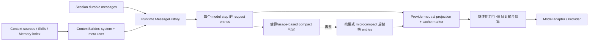

# B5：上下文管理的完整模型

## 问题与整体运行模型

本专题把“上下文”拆为来源、装配、请求投影、预算、缓存和缩减六个阶段。它回答的不是单个压缩函数如何工作，而是一次 model step 为什么看到这些材料、哪些材料被主动省略，以及超窗后谁改变下一次请求。基线：`872ad960de7ec172591f7e1952f7849229f94521`。

图中预算与媒体投影是两个不同阶段：token 压力可触发历史摘要；媒体字节预算则在模型请求边界替换旧媒体块或拒绝过大的本轮附件。工具 schema 在请求 `tools` 字段中，不是 ContextBuilder 的一段普通 system 文本。[turn-loop.ts:105-213](../../../apps/zcode-cli/packages/core/src/runtime/methods/turn-loop.ts) [model.ts:37-77](../../../apps/zcode-cli/packages/core/src/runtime/methods/model.ts)

## 1. 来源和加载时点

Context 初始化通过 `ContextSourcePort` 获取工作目录、环境、用户/项目指令，发现 Skills，再加载 Project Memory root 与 `MEMORY.md` 索引，构造 ContextBuilder 并初始化历史。它是一个有生命周期的快照：同一运行中 UI Skill catalog 读取 runtime 已发现的结果，新 runtime 才自然重新发现磁盘变化；冷恢复会重置并重新初始化 Context。[context.ts:40-90](../../../apps/zcode-cli/packages/core/src/runtime/methods/context.ts) [resume.ts:125-153](../../../apps/zcode-cli/packages/core/src/runtime/methods/resume.ts)

Builder 将稳定 system、动态 system、Skills metadata、项目指令和 Memory index 分区。Skills listing 默认有 20,000 字符预算，描述最多 250 字符；超过总 metadata budget 则降级为名称与路径。完整 Skill 正文由 `Skill` 工具按需加载，单次最多 100,000 bytes；Memory 只自动载入最多 200 行/25,000 字符的索引，事实正文靠 Read/Grep/Glob 按需读取。[builder.ts:130-306](../../../apps/zcode-cli/packages/core/src/context/builder.ts) [skills.ts:8-65](../../../apps/zcode-cli/packages/core/src/context/sections/skills.ts) [skill.ts:17-62](../../../apps/zcode-cli/packages/core/src/tool/handlers/skill.ts) [index-content.ts:1-37](../../../apps/zcode-cli/packages/core/src/memory/index-content.ts)

**设计推断：**这里的按需加载不是一个统一检索器，而是把“发现目录/元数据”与“加载正文”分开。这样能控制常驻上下文，但依赖模型在需要时主动调用工具，也会把检索失败或漏召回转化成任务质量问题。

## 2. 每步装配与请求可见性

每轮 loop 在工具与 MCP 初始化后筛选可用工具，插入适用的 plan/mode/todo/output-style reminder，再复制本轮 request entries 并作 Provider-neutral projection。投影会调整 attachment 的因果位置、按模型能力处理会话中间 system，并在最后的非 system message 放 ephemeral cache marker。一次性的 output-token continuation 会进入真实请求，但从用于记录的 projection 中排除。[turn-loop.ts:105-213](../../../apps/zcode-cli/packages/core/src/runtime/methods/turn-loop.ts) [provider-request-messages.ts:42-101](../../../apps/zcode-cli/packages/core/src/runtime/helpers/provider-request-messages.ts) [provider-request-messages.ts:286-334](../../../apps/zcode-cli/packages/core/src/runtime/helpers/provider-request-messages.ts)

由此要区分：ContextBuilder sections、运行时 entries、记录用 ModelRequest messages、实际请求 messages，以及 adapter 转换后的格式。缓存标记属于请求提示，不是本地“缓存命中即跳过请求”的结果缓存。[B1](b-message-context-and-provider-input.md)

## 3. Token 预算不是单一数字

普通请求的输出上限先取模型声明的最大值，未声明时用 32,000；preflight 用 `contextWindow - 估算输入 - 1,000` 限制本步输出，若估算剩余已非正数，保留 baseline 上限交给 Provider 的错误恢复，而不是本地直接认定请求不可能。[model-token-limits.ts:5-76](../../../apps/zcode-cli/packages/core/src/runtime/methods/model-token-limits.ts) [turn-model-step.ts:230-250](../../../apps/zcode-cli/packages/core/src/runtime/methods/turn-model-step.ts)

auto compact 的触发预算另算：有效窗口从模型 context window 扣输出预留（上限 21,000），再扣 13,000 buffer；默认窗口缺失时为 200,000。优先用最近已提交 assistant 的 Provider usage 基线加其后的本地增量，否则直接本地估算。它还要求有足够可摘要历史，并受连续失败和 rapid-refill breaker 约束。[policy.ts:6-151](../../../apps/zcode-cli/packages/core/src/compact/policy.ts) [compact.ts:184-340](../../../apps/zcode-cli/packages/core/src/runtime/methods/compact.ts)

本地估算是启发式，不能等同 Provider tokenizer。`estimateMessageTokens` 会计入正文、reasoning 与 tool-call 参数；Context usage breakdown 则将 system、meta-user、Skills、工具 schema 和 messages 分开统计，并明确标 `estimated/low confidence`，工具 schema 的真实 token 还取决于 Provider 序列化。因此 breakdown 是诊断视图，不能倒推“所有类别已受一个硬上限统一裁剪”。[manual.ts:102-139](../../../apps/zcode-cli/packages/core/src/compact/manual.ts) [context-usage.ts:119-254](../../../apps/zcode-cli/packages/core/src/runtime/methods/context-usage.ts)

**假设例子：**某模型窗口 200K，普通请求估算输入 165K，preflight 输出上限约 34K（再扣 1K，受模型自身上限约束）；auto compact 的有效输入窗口至多先扣 21K 再扣 13K buffer，因此可能在约 166K 触发。两者目的不同：前者限制本步输出，后者决定何时缩减历史。此例仅演示公式，未考虑具体模型配置和 Provider usage。

## 4. 媒体预算和历史裁剪

真实请求先经媒体 path/materialization、模型输入能力投影，再按默认 40 MiB 的聚合媒体预算筛选。最近的真实用户媒体受保护；若它单独超过预算，返回明确的附件过大错误，不悄悄删除本轮输入。剩余容量按最近历史媒体优先保留，省略的旧媒体变为文字占位；官方 CUA image/ref 配对另有联动处理。这里按请求编码字节衡量，不是 token 阈值，也不会修改原 Session transcript。[model.ts:37-77](../../../apps/zcode-cli/packages/core/src/runtime/methods/model.ts) [media-budget.ts:28-141](../../../apps/zcode-cli/packages/core/src/runtime/helpers/media-budget.ts) [media-budget.ts:188-260](../../../apps/zcode-cli/packages/core/src/runtime/helpers/media-budget.ts)

历史缩减则有两级：可选 microcompact 把旧工具结果局部清成标记，完整 compact 用 summary + 最近原文保留段替换 active runtime history。它们与媒体投影并不互相替代；例如单条最新附件过大，摘要旧轮也不能让那条附件本身变小。[B2](b-compaction.md)

## 5. Provider prompt cache 的边界

Builder 给稳定与动态 system block 标记 ephemeral；Provider-neutral projection 会清除旧的非 system marker，在最新非 system message 上重新标记。summary 请求可以把 marker 前移到真实历史，避免一次性 compact prompt 成为缓存写入边界。adapter 将该标记映射为 Anthropic provider options；usage 中的 cache-read/write tokens 用作诊断和后续 token 基线。[builder.ts:230-275](../../../apps/zcode-cli/packages/core/src/context/builder.ts) [provider-request-messages.ts:286-334](../../../apps/zcode-cli/packages/core/src/runtime/helpers/provider-request-messages.ts) [transform.ts:499-513](../../../apps/zcode-cli/packages/adapters/src/model/transform.ts) [compact.ts:310-340](../../../apps/zcode-cli/packages/core/src/runtime/methods/compact.ts)

这不等于 ZCode 自己持有可按 key 查询和失效的 prompt 结果缓存。marker 会随最后消息位置、Context 变化和 Provider 转换变化；是否真正命中由 Provider 决定。源码只支持“尝试形成可缓存前缀及观测 usage”，不能宣称跨 Provider 命中率或固定失效策略。

## 6. 系统级取舍与边界

ZCode 采用**分层而非单一全局裁剪器**：metadata/index 控制常驻内容，工具负责正文按需加载，preflight 限制本步输出，媒体投影限制请求体字节，microcompact/summary 缩减历史，Provider overflow 再触发 reactive 恢复。收益是不同资源有对应保护；代价是估算与真实 Provider 成本之间可能偏差，且“已加载到运行时”不等于“这一步真的发给模型”。

可迁移条件：为每一层保留输入/输出表示、预算单位、所有者、失败策略与恢复路径；别把字符上限、UTF-8 字节、token 和 Provider cache 用量混为一个指标。针对当前源码仍有边界未知：各 Provider 最终 wire 的准确 token 数、不同模型的 cache 命中，以及所有媒体格式组合的实际请求体大小；这些不是本次源码思想研究的完成阻碍。
