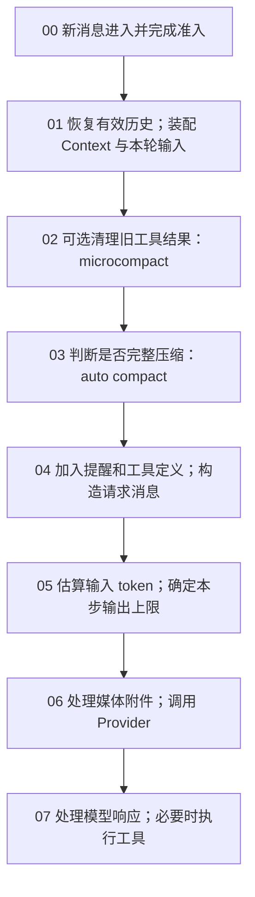
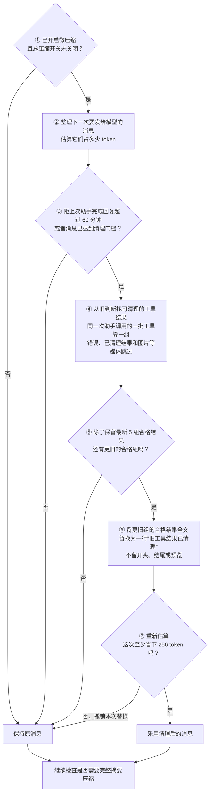
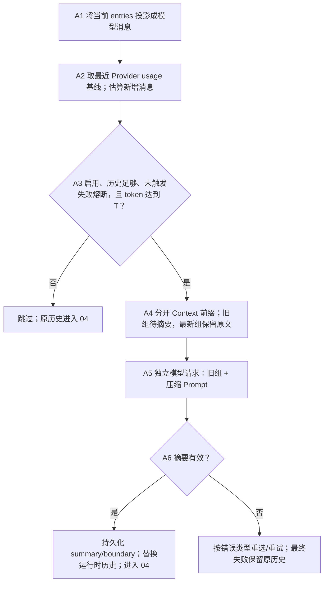

# B5：上下文管理的完整模型

## 一条消息经过上下文系统的路径

**阅读方向：从上往下，按 00 → 07。** 图只画一条主线；每个分支的判断标准、动作和下一站列在图下方。`02` 到 `07` 是一个 **model step**，同一用户消息可能因工具结果或续写多次回到 `02`。基线：`872ad960de7ec172591f7e1952f7849229f94521`。



**分支读法：**先按编号往下；遇到下表的条件，执行该行「动作」，再按「下一站」继续。`T` 指 auto compact 的输入 token 阈值，不是所有资源共用的阈值。

| 步骤 | 判断标准 | 动作与下一站 |
| --- | --- | --- |
| 01 | Runtime 是否需要冷恢复；本轮输入是否引用 `#sess_*` | 若需恢复，先从 Session 消息与 compact boundary 重建有效历史；随后加入新输入。Skills metadata 与 Memory 索引属于运行时上下文初始化。引用其他 Session 只附加提示，不自动导入其 transcript；若模型需要，会在 07b 调用 `ReadSessionContext`。→ 02 |
| 02 | `compact.microcompact.enabled === true`，且空闲超过默认 60 分钟或估算 token 达到 microcompact 阈值。默认阈值为 `max(0, min(floor(T × 0.9), T - 2K))`；另须有合格旧工具结果、保留最近默认 5 组、预计至少节省 256 token | 替换符合条件的旧工具结果；否则原样继续。→ 03 |
| 03 | auto compact 启用、有可摘要历史、连续失败未达默认 3 次，且 `tokenCount >= T`。默认 `T = max(0, contextWindow - min(maxOutputTokens, 21K) - 13K)`；窗口未知按 200K | 达标时选历史、摘要、持久化 boundary 并替换当前历史。成功或非取消失败都继续 → 04；rapid-refill breaker 触发则报错，取消则结束。 |
| 05 | `contextWindow - estimatedInput - 1K > 0` | 输出上限取模型上限与该剩余值的较小值；否则保留模型上限，交由 Provider/后续恢复路径判定。→ 06 |
| 06 | 媒体编码字节总量是否超过默认 40 MiB | 未超限 → Provider；超限但本轮真实用户媒体可保留 → 旧媒体按最近优先保留，其余变占位文本；仅本轮媒体已超限 → 附件错误，不进入 reactive compact。 |
| 07a | Provider 抛出 context-exceeded；或在无 tool call、无输出续写的分支返回相应 finish reason | 同一 model step 最多尝试一次 reactive compact；成功后回到 **02** 重建请求；失败、跳过则保留原错误，取消则结束。 |
| 07b | Provider 返回工具调用 | 各工具先处理原始输出，通用结果序列化再按各工具预算截断/落盘；结果提交到请求历史后回到 **02**。已追踪的批量汇合代码没有统一的「并发总结果 token 闸门」。 |
| 07c | Provider 达到输出 token 上限且允许续写 | 追加一次性续写输入，回到 **02**；若无法继续则返回输出上限错误。 |
| 07d | 没有待执行工具、续写或恢复分支 | 正常结束本轮。 |

[turn.ts:477-614](../../../apps/zcode-cli/packages/core/src/runtime/methods/turn.ts) [turn-loop.ts:47-213](../../../apps/zcode-cli/packages/core/src/runtime/methods/turn-loop.ts) [runtime microcompact.ts:24-115](../../../apps/zcode-cli/packages/core/src/runtime/methods/microcompact.ts) [compact/microcompact.ts:77-195](../../../apps/zcode-cli/packages/core/src/compact/microcompact.ts) [policy.ts:67-155](../../../apps/zcode-cli/packages/core/src/compact/policy.ts) [model-token-limits.ts:17-40](../../../apps/zcode-cli/packages/core/src/runtime/methods/model-token-limits.ts) [media-budget.ts:75-150](../../../apps/zcode-cli/packages/core/src/runtime/helpers/media-budget.ts) [turn-model-step.ts:647-664](../../../apps/zcode-cli/packages/core/src/runtime/methods/turn-model-step.ts) [turn-tools.ts:235-269](../../../apps/zcode-cli/packages/core/src/runtime/methods/turn-tools.ts)

这里把分支标准放在编号旁，后文再分别展开内部流程。特别注意：auto compact 在 **03**、普通请求输出预算在 **05**、媒体字节预算在 **06**，三者单位和失败策略不同。完整压缩细节见 [B2](b-compaction.md)，工具结果细节见 [B4](b-large-tool-results.md)。阅读时还须区分持久 Session 消息、运行时历史、当前 request entries、最终 Provider 请求和 UI 展示。

## 00–01. 一条新输入从哪里取得历史：冷恢复与 Context 初始化

这里的**冷恢复**有明确的运行时含义：协议层的 resident registry 里已没有这个 Session 的可执行 runtime，但 Session Store 仍有持久化记录。再次访问该 session 时，`activateSessionForResume` 先等待可能正在进行的去激活；若 registry 已有 record，直接复用；否则读取持久 Session，创建 record，调用 `app.resume()` / `resumeFromStore`。显式 `session/resume` 会走这条路径，V4 冷订阅也能先激活 runtime，再做自己的持久投影。进程重启后再次打开持久会话也属于同一类。它**不是** Provider prompt cache 过期，也不是每次新消息都重新读全库。[server-operations.ts:1402-1522](../../../apps/zcode-cli/packages/bootstrap/src/zcode-protocol/server-operations.ts)

为什么 runtime 会不常驻？常驻池默认目标 8、最高水位 16，候选连续空闲默认 10 分钟可因 idle timeout 去激活；超过高水位时可按 LRU 向目标数回收。只有已持久化、没有运行中工作/排队命令/交互/订阅/operation lease 的 Session 才可回收。去激活删除 resident record、关闭 app 并清理内存 event store，**不删除**持久 Session。故“过了 10 分钟就必定冷恢复”也不准确：必须先满足回收资格且确实发生去激活。[session-resident-pool.ts:7-11](../../../apps/zcode-cli/packages/bootstrap/src/zcode-protocol/session-resident-pool.ts) [session-resident-pool.ts:147-215](../../../apps/zcode-cli/packages/bootstrap/src/zcode-protocol/session-resident-pool.ts) [session-resident-pool.ts:226-260](../../../apps/zcode-cli/packages/bootstrap/src/zcode-protocol/session-resident-pool.ts) [session-residency.ts:45-67](../../../apps/zcode-cli/packages/bootstrap/src/zcode-protocol/session-residency.ts)

恢复不是把数据库消息原样拼成一个字符串。`resumeFromStore` 读取 Session 与消息，恢复工作目录、任务类型、workspace identity、环境和 shell 选择；重置旧 Runtime `MessageHistory` 与 ContextBuilder，先从持久记录 hydrate read-file state，再重新解析上下文来源、发现 Skills、加载当前 `MEMORY.md` 索引。接着修复未完成的 compact timeline，再根据分支/rewind 和最后有效 compact boundary 选择模型有效历史并 hydrate。assistant/tool parts 会还原成模型消息；未完成的工具调用变为 *interrupted* 工具结果，不会擅自重放工具。started/retrying 的 compact timeline 若已有 boundary 则收敛为 completed，否则收敛为 interrupted。最后恢复 mode/执行状态、权限、Todo、目标状态，并运行 `SessionStart(source="resume")` hook；目标状态另作为运行时提醒注入。[resume.ts:91-179](../../../apps/zcode-cli/packages/core/src/runtime/methods/resume.ts) [resume.ts:191-262](../../../apps/zcode-cli/packages/core/src/runtime/methods/resume.ts) [session-history-hydrator.ts:54-199](../../../apps/zcode-cli/packages/core/src/agent/session-history-hydrator.ts) [compact-persistence.ts:200-287](../../../apps/zcode-cli/packages/core/src/runtime/methods/compact-persistence.ts)

Context 初始化从 `ContextSourcePort` 得到指令/环境快照，并加载 Skill catalog、Memory root 和索引；随后 ContextBuilder 生成 system 与 meta-user 前缀。Memory 正文没有在每条消息开始时做语义检索：自动进入前缀的是索引（最多 200 行、25,000 字符），详情靠模型后续 Read/Grep/Glob。已运行的同一 runtime 复用 `memoryIndexContent` 快照；重新初始化/冷恢复才自然重新读取磁盘索引。每个新 turn 可从已有快照重建模型相关前缀，但不是重新扫描 Memory 文件。[context.ts:35-73](../../../apps/zcode-cli/packages/core/src/runtime/methods/context.ts) [context.ts:168-195](../../../apps/zcode-cli/packages/core/src/runtime/methods/context.ts) [request-user-context.ts:47-76](../../../apps/zcode-cli/packages/core/src/context/sections/request-user-context.ts) [index-content.ts:13-37](../../../apps/zcode-cli/packages/core/src/memory/index-content.ts) [context-refresh.ts:7-54](../../../apps/zcode-cli/packages/core/src/runtime/methods/context-refresh.ts)

**这里有两种容易混称的“Session memory”。**其一是当前 Session 的持久消息：它供冷恢复和完整 compact 的有效历史选择使用，不是每轮自动向模型灌入全部旧 transcript。其二是**跨 Session 按需读取**：真实用户输入出现 `#sess_*` 时，只附加一个提醒，明确旧会话不会自动展开；模型确需背景时，调用 `ReadSessionContext(sessionId, query, strategy)`。该工具读取另一会话的持久 Session 消息、先按有效分支/compact boundary 选取可读内容，再按 query 与字符预算选片段；有模型时可用单独的轻量提取请求，失败则回退本地选段。工具结果作为当前会话的一次 tool result 进入后续上下文，不等于本会话 `/resume`，也不是自动语义检索全部历史。[references.ts:5-27](../../../apps/zcode-cli/packages/core/src/session-context/references.ts) [turn.ts:863-872](../../../apps/zcode-cli/packages/core/src/runtime/methods/turn.ts) [read-session-context.ts:38-143](../../../apps/zcode-cli/packages/core/src/tool/handlers/read-session-context.ts) [session-context/read-session-context.ts:54-100](../../../apps/zcode-cli/packages/core/src/session-context/read-session-context.ts)

第三种是**Project Memory**：启用时跨会话共享同一 workspace identity 下的事实文件，初始化自动加载 `MEMORY.md` 索引，详情按需 Read；成功 turn 后可从 durable Session 快照后台提取更新。Subagent profile 还有独立 persistent memory 作用域。它们都不同于 `CompactTrigger.SessionMemory` 这个契约枚举：当前核心运行时检索到它用于 compact phase/reason 的分支映射，未找到发起该 trigger 的调用，故不能据枚举断言存在已启用的 Session-memory compact 流程。[project-memory.ts:5-28](../../../apps/zcode-cli/packages/core/src/runtime/helpers/project-memory.ts) [project-memory-extraction.ts:32-80](../../../apps/zcode-cli/packages/core/src/runtime/helpers/project-memory-extraction.ts) [runtime compact.ts:40-63](../../../apps/zcode-cli/packages/core/src/runtime/helpers/compact.ts) [subagent/persistent-memory.ts:70-100](../../../apps/zcode-cli/packages/core/src/subagent/persistent-memory.ts)；项目记忆详见 [B3](b-memory.md)。

新用户输入随后被写入运行时历史与 Session；当前 turn 从 `MessageHistory` 复制 `request entries`。这解释了为何后面的压缩要同时处理 canonical runtime history 和本轮请求副本。持久消息、运行时 entries、Provider 投影、UI 行仍是不同表示。[turn.ts:477-529](../../../apps/zcode-cli/packages/core/src/runtime/methods/turn.ts) [turn.ts:595-614](../../../apps/zcode-cli/packages/core/src/runtime/methods/turn.ts)

## 02. Microcompact：只清旧工具结果，不生成摘要

**可复现的核心规则：不截取单条结果的前/后片段，也不按 Token 预算裁中间。选中一条 tool result，就把它的整个 `content` 替换为 33 字符的 `[Old tool result content cleared]`；未选中的结果保持原样。Token 数只控制是否尝试以及总替换是否值得提交。**

这 9 个工具共享**同一条结果级规则**，没有 `Read` 留文件头、`Bash` 留日志尾之类的专用算法。被替换的是模型对话中那条旧结果的 content，不是被读文件、工作区文件、命令输出落盘文件、工具调用参数或持久 Session 原记录。若一次批次内仅部分结果符合条件，只替换符合条件的那些结果。[候选规则](../../../apps/zcode-cli/packages/core/src/compact/microcompact.ts) · [回写边界](../../../apps/zcode-cli/packages/core/src/runtime/helpers/compact.ts)

**每次准备调用模型前，都经过下面的检查。** 从上往下读；图中数字是默认配置。清理门槛怎么算，紧接在图下解释。



**③ 清理门槛怎么算？** 先从模型的上下文容量中扣出回复预留空间（最多 21,000 token），再扣 13,000 token 缓冲，得到“完整摘要压缩门槛”。微压缩会更早介入：取该门槛的 **90%** 和“该门槛减 2,000”中较小的值。例如上下文容量为 200,000、模型允许回复 32,000 token 时：完整压缩门槛为 `200,000 − 21,000 − 13,000 = 166,000`；微压缩门槛为 `149,400`。这是按默认规则举例，模型属性或配置改变后须重新计算。

**④ 哪些工具可清？** 默认只选 Read、Bash、Grep、Glob、WebFetch、WebSearch、Edit、Write、ApplyPatch 的结果。组内有不合格结果时，仅跳过那些结果；并不连带跳过整组。“保留 5 组”只数含合格结果的组，不是最近 5 条消息。

**⑥ 替换成什么？** 图中用中文表达含义，源码实际写入的固定文本是 `[Old tool result content cleared]`。工具调用参数、调用 ID 和结果顺序保留，工具结果正文整条替换。下面再给精确参数和源码对应关系，便于实现时核对。

| 决策点 | 实际输入与计算 | 容易误解的边界 |
| --- | --- | --- |
| ② 整理待发送消息 | `buildProviderRequestMessages(entries, applyCacheControl: false)` 把 runtime attachment 包成模型消息，处理其顺序及会话中途 system 的表示，剥离内部 metadata；**尚未调用 Provider**。Microcompact 以这份消息判断“模型会看到什么”，再凭 `toolCallId` 回写对应 runtime entry。 | 不是读取 SQLite/UI 文本，也不是最终 wire payload；工具 schema 和之后的媒体预算不在本次估算中。 |
| ②–③ 估算与触发 | 对每条投影消息：`ceil((内容文本长度 + tool-call 名称及 JSON 入参长度) / 3)`，逐条求和；reasoning 文本计入，image/video 等按文字占位估，**不用 Provider usage**。`T = max(0, W − min(R, 21,000) − B)`；默认 `W=200,000`、`R=模型声明的最大输出或 32,000`、`B=13,000`。`M` 默认 `max(0, min(floor(0.9×T), T−2,000))`，可由 `microcompact.thresholdTokens` 覆盖。 | 时间阈值是距**上次 assistant 完成**严格大于默认 60 分钟；没有完成时间就不能走时间分支。时间条件先判断，同时满足时标记为 time-based。配置可覆盖 idle 分钟数。 |
| ④–⑦ 选择、替换与收益 | 默认候选工具：Read、Bash、Grep、Glob、WebFetch、WebSearch、Edit、Write、ApplyPatch；默认排除错误、已清过、含 image/video/file 的结果。每遇到一次 assistant tool-call 批次建立一组，同批多个合格结果同组；仅统计**合格组**。保留最新默认 5 组（配置可覆盖，但最少 1 组），清更旧组中全部合格结果。用替换前后同一估算器算差额；小于默认 256 token 则撤销整个清理。 | 不是删最早 5 条消息，也不是按字节截一段；单个不合格结果不使同批其他合格结果失去资格。 |

**实现级伪代码（保持源码判定顺序）：**

```text
每次 model step 前：
  若 compact.enabled=false：退出
  messages = project(runtimeEntries, applyCacheControl=false)
  before = sum_per_message(ceil((contentTextChars + toolCallNameAndJsonChars)/3))
  T = max(0, (W - min(R, 21000)) - B)
  M = 配置的 thresholdTokens，否则 max(0, min(floor(T*0.9), T-2000))
  若 micro 未显式开启：退出
  若 now-lastAssistantCompletedAt <= idleMinutes*60000 且 before < M：退出
  顺序扫描 messages：每遇 assistant(toolCalls 非空) 开新批次；
    收集后续 role=tool、工具名在白名单、带 toolCallId、非错误、
    未带清理标记、content 无 image/video/file 的结果；空批次不计数
  groups = 所有非空合格批次（孤立的合格 tool result 各自成组）
  k = max(1, 配置的 keepRecentToolResults，否则 5)
  若 groups.length <= k：退出
  对 groups[0 : groups.length-k] 内每条合格结果：整个 content 换为固定标记
  after = 用同一估算器对替换后 messages 求和
  若 max(0,before-after) < 配置的 minTokenSavings（否则 256）：撤销并退出
  按 toolCallId 把替换写入 runtime MessageHistory 与本轮 request entries；发边界事件
```

**可复算例子（假设输入，非运行记录）：**`W=200,000`、`R=32,000`、`B=13,000`，故 `T=166,000`、`M=149,400`。投影总估算 `120,000`，但距上次 assistant 完成已过 61 分钟，因时间条件仍进入扫描。合格批次 G1…G7 中，G1 有 Read、Bash 两条结果，G2 有 Grep 一条；它们各为 900 字符纯文本，其余消息合计估算 `119,100`。保留 G3…G7，清 G1/G2 三条：每条从 `ceil(900/3)=300` 变为 `ceil(33/3)=11` token，合计节省 `3×(300−11)=867`，结果估算 `119,133`；`867≥256`，提交。若三条合计只省 200 token，则整次撤销，没有“先清一点”的退让。下一步已清的 G1/G2 不再入候选；若出现 G8 且仍触发，剩余合格组 G3…G8 中才轮到 G3。[投影](../../../apps/zcode-cli/packages/core/src/runtime/helpers/compact.ts) · [估算器](../../../apps/zcode-cli/packages/core/src/compact/manual.ts) · [候选与替换](../../../apps/zcode-cli/packages/core/src/compact/microcompact.ts) · [阈值构造](../../../apps/zcode-cli/packages/core/src/runtime/methods/microcompact.ts)

**Prompt Cache 的影响：**Microcompact 判断用的投影指定 `applyCacheControl: false`，它本身既不发模型请求，也不操作 Provider 缓存；若跳过或因收益不足撤销，缓存输入不因它改变。若真正清掉 G1/G2，下一次发给模型的消息在首条被清结果处就与旧请求不同，因此跨过该位置的**完全相同前缀缓存不能原样复用**；在它之前未变的前缀仍可能复用。最终请求会在重新投影后设置新的 ephemeral cache marker，适配器再映射到 Provider；源码不能保证某个 Provider 实际命中多少、缓存何时过期或是否按此粒度计费。因此代价是一次可能的缓存命中下降，收益是旧工具正文更少占用模型上下文；这里没有看到“先比较缓存成本再决定是否 microcompact”的门槛。[Micro 投影](../../../apps/zcode-cli/packages/core/src/runtime/helpers/compact.ts) · [最终请求及 marker 时机](../../../apps/zcode-cli/packages/core/src/runtime/methods/turn-loop.ts) · [marker 位置](../../../apps/zcode-cli/packages/core/src/runtime/helpers/provider-request-messages.ts) · [Provider 映射](../../../apps/zcode-cli/packages/adapters/src/model/transform.ts)

**采用清理结果时，只改两份活跃表示：**运行时 canonical `MessageHistory` 与本轮 `request entries`。被选结果的 content 变为 `[Old tool result content cleared]`；tool-call ID、顺序和配对保留。默认 `MicrocompactBoundary` 进入内存 eventStore；原 Session tool part 不回写，UI transcript 不缩短。故同一 Runtime 的后续模型步骤继续看到占位符，但冷恢复从持久 tool part 重建时不会回放这次清理。[runtime microcompact.ts:73-102](../../../apps/zcode-cli/packages/core/src/runtime/methods/microcompact.ts) [turn-tools.ts:286-345](../../../apps/zcode-cli/packages/core/src/runtime/methods/turn-tools.ts) [events.ts:263-280](../../../apps/zcode-cli/packages/core/src/runtime/methods/events.ts)

| 冷恢复时的来源 | 原工具结果还在吗？ | 会不会直接回到模型？ |
| --- | --- | --- |
| SQLite Session tool part | Microcompact 不改原 `output`/持久媒体。 | hydrator 可重建；但若后来有**完整 compact boundary**，仍要先按 boundary 选择有效历史。 |
| `model-io-<session>.jsonl` 诊断 | 可能记过清理前或清理后的请求；默认会缩减、限额、轮转、脱敏。显式全量保留模式另有规则。 | **不会作为冷恢复源**，不能凭 JSONL 曾含原文保证可恢复。 |

若之后的完整 compact 摘要基于已清理的运行时历史生成，Microcompact 还可能**间接影响持久化摘要**，尽管它没有修改原 tool part。[冷恢复](../../../apps/zcode-cli/packages/core/src/runtime/methods/resume.ts) · [tool part hydration](../../../apps/zcode-cli/packages/core/src/agent/session-history-hydrator.ts) · [SQLite store](../../../apps/zcode-cli/packages/adapters/src/storage/session-store.ts) · [诊断 JSONL](../../../apps/zcode-cli/packages/adapters/src/model/runner-debug.ts)

**退出再恢复，会不会把旧全文又塞进模型？** 会有“恢复后重新膨胀”的可能，但恢复动作本身还没有向 Provider 发请求。按实际顺序看：

1. 退出前仅发生 Microcompact、没有后续完整 compact boundary 时，SQLite 保留旧 tool part 原文；`resumeFromStore` 按有效历史重新 hydrate，旧结果回到新的 `MessageHistory`。它也从最近有效 assistant 的持久完成时间恢复 `lastAssistantCompletedAtMs`；并不重放旧的 MicrocompactBoundary。若已经成功完整 compact，冷恢复会先按该 boundary 选摘要和保留段，旧消息虽然仍在库中，却不全回到有效历史。[resume.ts:152-189](../../../apps/zcode-cli/packages/core/src/runtime/methods/resume.ts) [hydrator.ts:54-199](../../../apps/zcode-cli/packages/core/src/agent/session-history-hydrator.ts) [compact-session.ts:4-46](../../../apps/zcode-cli/packages/core/src/agent/compact-session.ts)
2. 下一条用户输入进入第一个 model step，**先**用重建的完整 entries 再跑图中 ①–⑦，**后**跑 Auto compact。如果 Microcompact 已启用，距上次 assistant 完成超过 60 分钟，或重新投影估算 `E >= M`，它会再次扫描并清理；未启用、两个触发均未满足、合格旧组不够或节省不足 256 时，旧结果保持原样。故不能说“恢复时自动沿用上次 Microcompact 的节省”。[turn-loop.ts:67-103](../../../apps/zcode-cli/packages/core/src/runtime/methods/turn-loop.ts) [microcompact.ts:24-115](../../../apps/zcode-cli/packages/core/src/runtime/methods/microcompact.ts)
3. Auto compact 接着按 `T` 判断是否另发摘要请求。它优先取**最近已提交 assistant 的 Provider usage 基线 + 后续消息本地估算**，而非无条件重算恢复后全文。特别是上次 Microcompact 清理后又发过模型请求时，该 usage 可反映“已清理的上下文”，冷恢复却重新引入更早 tool part 全文；若旧内容位于 usage 基线之前，Auto 的增量计算不会补回它们，**存在低估、未提前压缩的条件性风险**。这是源码推论，尚未用真实 Provider 验证。[compact.ts:317-350](../../../apps/zcode-cli/packages/core/src/runtime/methods/compact.ts) [usage.ts:54-65](../../../apps/zcode-cli/packages/core/src/runtime/methods/turn-model-step-usage.ts)
4. 普通请求前的 output preflight 用同一 `estimateCurrentModelInputTokens` 估算输入，并把输出上限裁到 `min(R, floor(W-estimatedInput-1000))`；若算得非正，反而保留原输出上限，交给后续错误恢复，**不是阻断超窗输入的硬闸门**。若 Provider 报 context-exceeded，或返回相应 finish reason，Reactive compact 在同一 model step 最多尝试一次完整摘要并重试；摘要失败、历史不足、功能关闭或保护条件阻断时，原超窗错误仍可能抛出。因此“退出再进来一定不会撑爆”并无源码保证。[model-token-limits.ts:17-40](../../../apps/zcode-cli/packages/core/src/runtime/methods/model-token-limits.ts) [turn-model-step.ts:239-252](../../../apps/zcode-cli/packages/core/src/runtime/methods/turn-model-step.ts) [turn-model-step.ts:375-439](../../../apps/zcode-cli/packages/core/src/runtime/methods/turn-model-step.ts) [turn-model-step.ts:499-524](../../../apps/zcode-cli/packages/core/src/runtime/methods/turn-model-step.ts)

这里的“撑爆上下文”是下一次 Provider 输入超窗；冷恢复重建旧消息也有本地内存成本，但源码路径没有据此给出可量化内存上限。Microcompact 不保证清理后低于 Auto compact 阈值；清理后下一站仍是 03。

## 03. Auto compact：判定、摘要、替换和冷重建

**阅读方向：A1 → A6；跳过或失败回到总流程 04。**与微压缩不同，Auto compact 的触发值优先使用最近一次已提交的 Provider usage。



| 步骤 | 具体规则 | 输出或边界 |
| --- | --- | --- |
| A1–A3：判断 | 投影方式与微压缩的步骤 ② 类似。找到最近已提交 assistant 的有效 usage：若它已覆盖 assistant 输出，用 `contextUsageTokens + 后续消息本地估算`；否则用 `inputTokens + 从该 assistant 起的本地估算`。没有有效 usage 才对全部投影消息按微压缩的字符估算。`T = max(0, W − min(R,21K) − B)`，默认 `W=200K`、`R=模型最大输出或32K`、`B=13K`；`tokenCount >= T` 才可压缩。 | `compact.enabled=false`、正文分组少于 2 组**或**没有 assistant、连续失败达到默认 3 次、未到 T 均跳过。达到 T 后还检查 rapid-refill breaker：若距上次 compact 不足 3 个已完成工具批次且连续快速再触发达到 3 次，就报错。Microcompact 的“空闲 60 分钟”不参与 A3。 |
| A4：选择 | 从 active entries 复制快照，单独取出 system/Context 前缀；剩余历史按**新 assistant 消息开始**划组。Auto 默认保留最新 1 组逐条原文，其余组用于摘要；至少还要有 1 组可摘要。 | 组不是固定“一条 user + 一条 assistant”；tool result、后续 user/attachment 可能同属一组。前缀只供摘要模型理解，不算作被摘要的会话正文。 |
| A5：生成 | 将压缩 Prompt 作为最后一条 user 消息接在选中历史后，随后做媒体能力与字节预算投影。Prompt 要求按时间保留用户要求、技术细节、错误、反馈及待办，以 `<analysis>`/`<summary>` 返回，禁止工具调用；模型输出最多 20K，工具数超过 100 时请求不传工具。Auto 无自定义指令，手动 `/compact` 可追加。 | 这是**另一笔模型调用**，不是本轮普通请求就地改写。模型真的返回 tool call 或摘要无效会失败。完整 Prompt 见 [`compact/prompt.ts`](../../../apps/zcode-cli/packages/core/src/compact/prompt.ts)。 |
| A6：提交 | 去掉 `<analysis>`，整理 `<summary>`，生成一条对 UI 隐藏、对模型可见的 synthetic user summary；持久化 summary 和 compact boundary，再把运行时历史换成 `当前 Context 前缀 + summary + 最后保留组原文 + 后置提醒`。 | 旧 Session 消息不物理删除，但后续模型不自动再看到被摘要组全文；冷恢复按 boundary 复原有效历史。 |

**分组实例（假设序列）：**`前缀, U1, A1(tool), T1, U2, A2(tool), T2, U3, A3` 会切成 `G1=[U1]`、`G2=[A1,T1,U2]`、`G3=[A2,T2,U3]`、`G4=[A3]`。默认摘要输入是 `前缀+G1+G2+G3+压缩 Prompt`，G4 原样进入新历史；不是按 user 消息切轮。[实际分组函数](../../../apps/zcode-cli/packages/core/src/compact/rounds.ts) · [runtime 分组调用](../../../apps/zcode-cli/packages/core/src/runtime/helpers/compact-selection.ts)

**微压缩估算与 Auto 的 A2 不能混为一笔账：**Microcompact 的本地估算会直接反映已替换的旧工具结果；Auto compact 若找到了较早的 Provider usage 基线，只估算该 assistant 之后的消息。若清掉的结果已包含在基线内，A2 不会从旧 usage 中反向扣除节省值，因此微压缩成功也不能保证 A3 低于阈值。这是由两个计数路径推得的条件性结论，不是运行验证。[Microcompact 本地估算](../../../apps/zcode-cli/packages/core/src/compact/microcompact.ts) · [Auto usage 基线](../../../apps/zcode-cli/packages/core/src/runtime/methods/compact.ts)

**异常不是一个笼统“重试”。**摘要请求媒体过大时，剥离媒体重试；摘要请求超窗时，把更多最近组从摘要输入移到“保留原文”，使摘要请求变小，但压缩后的上下文可能因此更大。Auto/Reactive 不用“丢最旧组”兜底；Auto 整个可重试操作最多 3 次，Reactive 一次。Auto 最终失败保留原历史继续普通请求；取消直接传播。已触发 rapid-refill breaker 则在调用摘要前报错。这里的“重选组”和“整个操作重试”是两层不同的尝试。[触发和 usage](../../../apps/zcode-cli/packages/core/src/runtime/methods/compact.ts) · [阈值](../../../apps/zcode-cli/packages/core/src/compact/policy.ts) · [分组](../../../apps/zcode-cli/packages/core/src/runtime/helpers/compact-selection.ts) · [摘要请求与提交](../../../apps/zcode-cli/packages/core/src/runtime/methods/compact-active.ts)

**A6 还有两个易漏细节：**保留组的 assistant usage 会失效，防止旧 usage 被误当作新请求 token 基线；summary message 没有传 `transcriptPath`，因此旧 Session 事实虽在，模型不会自动得到全文读取路径。摘要有损，只有保留组逐条留原文。[prompt.ts:119-165](../../../apps/zcode-cli/packages/core/src/compact/prompt.ts) [runtime compact.ts:72-87](../../../apps/zcode-cli/packages/core/src/runtime/helpers/compact.ts) [runtime compact.ts:157-166](../../../apps/zcode-cli/packages/core/src/runtime/helpers/compact.ts) [compact-active.ts:517-548](../../../apps/zcode-cli/packages/core/src/runtime/methods/compact-active.ts)

**哪些东西单独保留或重新注入？**下表把“模型能否继续看到”与“底层事实是否还在”分开：

| 对象 | compact 当下 | 之后冷恢复 / 限制 |
| --- | --- | --- |
| Session transcript | 旧消息不物理删除；写 summary message、`CompactBoundary`、后置提醒，随后替换 runtime history | `activeSessionMessages` 从最后有效 boundary 选历史，并按 `preservedSegment` 的 head/tail ID 插回最近保留消息；旧全文仍在 store，不等于自动回到模型上下文。[compact-active.ts:549-625](../../../apps/zcode-cli/packages/core/src/runtime/methods/compact-active.ts) [compact-session.ts:4-46](../../../apps/zcode-cli/packages/core/src/agent/compact-session.ts) |
| 已读文件内容 | 从 `readFileState` 选最近最多 5 个合格 Read；单文件约 5K token 内可重新注入带行号内容，过大或总预算不足则只注入路径和“可再 Read”提示；保留段已含该 Read 时跳过 | 后置提醒随 summary 一起持久化；提交后 runtime `readFileState.clear()`。文件本身仍在工作区，但不是无损重灌所有已读文件。[compact-post-reminders.ts:8-66](../../../apps/zcode-cli/packages/core/src/runtime/helpers/compact-post-reminders.ts) [compact-active.ts:484-501](../../../apps/zcode-cli/packages/core/src/runtime/methods/compact-active.ts) [compact-active.ts:615-625](../../../apps/zcode-cli/packages/core/src/runtime/methods/compact-active.ts) |
| 已批准 Plan | 若 Session 对应 plan 文件存在，读出并生成 `plan_file_reference` 后置提醒 | 提醒持久化，可在冷恢复中还原；文件读取有字节上限，缺失则不注入。不是所有规划内容都自动保存成 plan 文件。[plan-file-continuity.ts:59-101](../../../apps/zcode-cli/packages/core/src/runtime/helpers/plan-file-continuity.ts) |
| Todo 与长期目标 | Todo 不靠摘要作唯一备份：`TodoWrite` 更新 Session Store；目标也有独立 Session 存储。普通 step 仅在 Todo reminder 条件满足时读取并注入当前列表 | cold resume 分别读取 Todos/target；目标状态明确注入运行时历史。Todo reminder 是条件性提醒（默认距上次写入和上次提醒各至少 10 个 assistant turns），不是每轮必有。[todo.ts:47-71](../../../apps/zcode-cli/packages/core/src/tool/handlers/todo.ts) [turn-loop.ts:138-155](../../../apps/zcode-cli/packages/core/src/runtime/methods/turn-loop.ts) [runtime-reminders.ts:81-84](../../../apps/zcode-cli/packages/core/src/runtime/helpers/runtime-reminders.ts) [runtime-reminders.ts:163-179](../../../apps/zcode-cli/packages/core/src/runtime/helpers/runtime-reminders.ts) [resume.ts:233-262](../../../apps/zcode-cli/packages/core/src/runtime/methods/resume.ts) |
| Skills 与 Memory | Skills catalog 和 Memory 索引属于 Context 前缀，随前缀保留；已调用 `Skill` 得到的正文是工具结果，进入摘要区时由模型概括，落在最近保留组才逐字保留 | cold resume 重新发现 Skills、重读 Memory 索引；`Skill` 正文可再次调用工具从磁盘加载，Memory 详情可 Read。未发现“当前执行 Skill”的独立运行时栈或无损重注入步骤，不能把 catalog 可用误说成旧正文仍在上下文。[context.ts:35-73](../../../apps/zcode-cli/packages/core/src/runtime/methods/context.ts) [skill.ts:16-70](../../../apps/zcode-cli/packages/core/src/tool/handlers/skill.ts) [request-user-context.ts:47-76](../../../apps/zcode-cli/packages/core/src/context/sections/request-user-context.ts) |
| Plugin 引用与 Hook 追加内容 | `plugin_reference` reminder 由真实用户输入解析，匹配当时 live catalog 后写为 model-only synthetic Session 消息；旧引用是否进 summary 或最近原文由位置决定。Hook additional context 是 runtime attachment，也受同样的摘要/保留选择 | plugin reminder 若仍属有效历史可 hydration；新 turn 仅对新的真实引用重新解析。`SessionStart` hook 在新 runtime 的 resume 路径运行；同一 runtime 有 once 标志，auto compact 不会凭空重新运行所有 hook。`UserPromptSubmit` 旧输出没有独立“无损恢复”为当前提醒的证据。[plugin-reference.ts:80-149](../../../apps/zcode-cli/packages/core/src/runtime/methods/plugin-reference.ts) [hooks.ts:20-47](../../../apps/zcode-cli/packages/core/src/runtime/methods/hooks.ts) [hooks.ts:106-117](../../../apps/zcode-cli/packages/core/src/runtime/methods/hooks.ts) [resume.ts:254-262](../../../apps/zcode-cli/packages/core/src/runtime/methods/resume.ts) |

**持久提交与冷重建顺序。**先持久化 summary text/compaction part 和后置提醒；再写 boundary event、completed timeline；最后替换 runtime `MessageHistory` 并清 read-file state。持久化提醒任一步失败会 best-effort 回滚本次消息。冷恢复选择最后有效 boundary，插回 boundary 记载的最近保留段；若进程在 compact started/retrying 时退出，有 boundary 则修复为 completed，没有则 interrupted。这里的“恢复上下文”是按持久结构**重建新的模型有效视图**，不是把压缩前所有信息无损解压回来。[compact-active.ts:575-630](../../../apps/zcode-cli/packages/core/src/runtime/methods/compact-active.ts) [compact-persistence.ts:289-381](../../../apps/zcode-cli/packages/core/src/runtime/methods/compact-persistence.ts) [resume.ts:147-179](../../../apps/zcode-cli/packages/core/src/runtime/methods/resume.ts)

**Memory 与 compact 不是同一条备份链。**项目 Memory 文件是独立的持久事实；成功 turn 结束后可另行调度后台提取，从 durable conversation 快照提炼并更新 Memory。`compactActiveConversation` 本身不把 summary 自动当成新的 Memory 文件；冷恢复只是重新读取现有索引，详情仍按需访问。摘要 Prompt 中“保留约束、错误与用户反馈”的要求属于模型生成目标，不能当作字节级保真承诺。[turn.ts:688-703](../../../apps/zcode-cli/packages/core/src/runtime/methods/turn.ts) [project-memory-extraction.ts:32-80](../../../apps/zcode-cli/packages/core/src/runtime/helpers/project-memory-extraction.ts) [context.ts:60-72](../../../apps/zcode-cli/packages/core/src/runtime/methods/context.ts) [prompt.ts:14-43](../../../apps/zcode-cli/packages/core/src/compact/prompt.ts)

**“正在执行 Skill”还要区分两种状态。**如果 Skill 工具已经返回，正文只是历史中的一条 tool result：它可能进入摘要、最近保留组，或因 microcompact 被清理。如果进程在工具仍处于 pending/running 时消失，冷恢复会给该 tool call 放入 interrupted 结果，不会从调用中间继续执行；后续是否重新调用 Skill 由新的模型步骤决定。源码中没有把 Skill 当成可 checkpoint/restore 的独立解释器或指令栈。[skill.ts:18-70](../../../apps/zcode-cli/packages/core/src/tool/handlers/skill.ts) [session-history-hydrator.ts:149-190](../../../apps/zcode-cli/packages/core/src/agent/session-history-hydrator.ts)

## 04. 动态请求装配：哪些内容此刻真正可见

前面的 03 结束后，loop 才初始化 MCP、按当前执行状态筛选工具，并视条件追加 plan/mode/Todo/output-style 等提醒；然后从本轮 entries 构造 Provider-neutral 消息，调整 attachment 顺序和 cache marker。工具定义在请求 `tools` 字段，不能把其 token 成本当成一段普通 system 文本。模型可见消息与用于记录的 `ModelRequest` 投影还可能不同：一次性 output-token continuation 会进入真实请求，却从记录投影过滤。[turn-loop.ts:105-213](../../../apps/zcode-cli/packages/core/src/runtime/methods/turn-loop.ts) [provider-request-messages.ts:286-334](../../../apps/zcode-cli/packages/core/src/runtime/helpers/provider-request-messages.ts)

Memory 的常驻部分是索引而非自动检索出来的正文；`Skill` 目录信息是 catalog 而非全部 SKILL.md；Plugin 引用提醒只在用户确实提交引用且能与 live 能力交集匹配时出现。一次消息最终看到的内容取决于这几条路径和前面的 compact 结果，不宜用“系统把所有资料拼接后裁剪”概括。[context.ts:60-72](../../../apps/zcode-cli/packages/core/src/runtime/methods/context.ts) [skill.ts:36-70](../../../apps/zcode-cli/packages/core/src/tool/handlers/skill.ts) [plugin-reference.ts:80-131](../../../apps/zcode-cli/packages/core/src/runtime/methods/plugin-reference.ts)

## 05. 为什么压缩后还要估算 token

这里是**两次不同决策**，不是 03 没有估算。03 在当前历史上估算输入压力，问题是“要不要花一个独立模型请求生成摘要”；05 在 **03 可能已经替换过的当前请求** 上再次估算，问题是“本次普通模型请求最多允许输出多少 token”。此外 04 又可能追加提醒与工具可见能力，所以 03 的旧数字不能直接作为 05 的新请求预算。两次都优先利用已提交 assistant 的 Provider usage 基线加本地增量，否则退回本地估算；估算不等于最终 Provider tokenizer。[compact.ts:201-214](../../../apps/zcode-cli/packages/core/src/runtime/methods/compact.ts) [compact.ts:313-349](../../../apps/zcode-cli/packages/core/src/runtime/methods/compact.ts) [turn-loop.ts:105-213](../../../apps/zcode-cli/packages/core/src/runtime/methods/turn-loop.ts) [turn-model-step.ts:230-250](../../../apps/zcode-cli/packages/core/src/runtime/methods/turn-model-step.ts)

05 的公式是：模型声明的输出上限（未声明时 32K）与 `contextWindow − estimatedCurrentInput − 1K` 取较小正值；若估算剩余非正数，保留模型 baseline 上限，让 Provider 错误触发后续恢复，而不是把启发式估算当作本地硬拒绝。03 的阈值则预留至多 21K 输出和默认 13K buffer，目的不同。[model-token-limits.ts:5-40](../../../apps/zcode-cli/packages/core/src/runtime/methods/model-token-limits.ts) [policy.ts:67-87](../../../apps/zcode-cli/packages/core/src/compact/policy.ts)

**数字例子（假设模型窗口 200K、输出上限 32K）：**03 的默认 auto 阈值为 `200K − 21K − 13K = 166K`。旧历史估算 170K 且可摘要，先 compact；假设新历史变 60K，05 再算可用输出为 `min(32K, 200K − 60K − 1K) = 32K`。若 compact 因历史不足而未运行，输入估算 190K，则 05 上限约 9K。若估算已超过窗口，代码不会因该估算直接停止，而由 Provider 的真实超窗反馈决定是否走 reactive 分支。以上数字仅说明代码公式，未运行 Provider。

## 06–07. 媒体、工具结果与异常如何回到下一步

06 在 `runModelTextRequest` 中依次解析附件路径、按模型输入能力投影，再对本次请求所有媒体按**编码后字节**施加默认 40 MiB 聚合预算。若超限，保护最新真实用户消息的媒体，历史媒体按最近优先保留，丢弃的旧块变文字占位；若最新用户媒体自己已超限，直接抛当前附件过大错误。这是请求投影，不改 Session transcript，也不能靠摘要旧消息解决单个新附件过大。[model.ts:36-77](../../../apps/zcode-cli/packages/core/src/runtime/methods/model.ts) [media-budget.ts:75-150](../../../apps/zcode-cli/packages/core/src/runtime/helpers/media-budget.ts)

07 收到工具调用时，工具调度可并发，但返回结果按 tool-call ID 汇合并按原调用顺序提交。每个工具可能先在自己的适配器层限制原始输出；之后通用 `resultBudget` 默认按 UTF-8 字节给模型可见内容 100,000 bytes 上限并截断，显式启用 artifact 策略的工具才会将那一层的完整可见内容外置。以 Bash 为例，它在更早的进程采集层给 inline 内容 30,000 bytes 上限、持久文件最多 5 GiB：前台超 inline 才保留文件，后台始终持久化。因此“有 artifact path”并不等于原始 stdout 永远完整。批量汇合处没有统一的“所有并发工具结果总 token”闸门；这些结果提交到运行时历史与当前请求后回到 02，由下一次 micro/auto 判断处理。旧结果通过 microcompact 清掉后，只有先前提供了仍可访问的文件路径且采集层确实保留了完整内容，模型才能用 Read 恢复读取；普通截断结果不能凭清除标记逆推出原文。[turn-tools.ts:235-269](../../../apps/zcode-cli/packages/core/src/runtime/methods/turn-tools.ts) [turn-tools.ts:279-366](../../../apps/zcode-cli/packages/core/src/runtime/methods/turn-tools.ts) [result-serialization.ts:33-86](../../../apps/zcode-cli/packages/core/src/tool/executor/result-serialization.ts) [result-serialization.ts:161-217](../../../apps/zcode-cli/packages/core/src/tool/executor/result-serialization.ts) [bash.ts:70-71](../../../apps/zcode-cli/packages/core/src/tool/handlers/bash.ts) [bash.ts:420-427](../../../apps/zcode-cli/packages/core/src/tool/handlers/bash.ts)

Provider 抛 context-exceeded，或在无 tool call/无输出续写时返回相应 finish reason，才走 reactive compact；同一个 model step 最多尝试一次，成功后替换 entries、重建 turn machine，再回到 02 重新组装。若没有足够历史、compact 禁用或恢复失败，就保留原错误；rapid-refill breaker 另有显式错误。summary 请求自身的 prompt-too-long、媒体太大按 03 的内部重试处理，不能与普通请求的 reactive 分支混为一谈。输出 token 到上限则走独立的 continuation 分支。[turn-model-step.ts:429-439](../../../apps/zcode-cli/packages/core/src/runtime/methods/turn-model-step.ts) [turn-model-step.ts:500-524](../../../apps/zcode-cli/packages/core/src/runtime/methods/turn-model-step.ts) [turn-model-step.ts:647-705](../../../apps/zcode-cli/packages/core/src/runtime/methods/turn-model-step.ts) [turn-model-step.ts:742-802](../../../apps/zcode-cli/packages/core/src/runtime/methods/turn-model-step.ts)

这套设计的可迁移要点是把**摘要历史、保留原文、独立持久状态、外置文件和请求时投影**分开设计。完整 compact 不是无损存档：Session 旧消息仍在，但当前模型不自动看见；文件与 Todo 仍可读取，但未必自动注入；Skill/Hook 旧内容若落入摘要区，只能依赖摘要质量或显式重新加载。对当前仓库的判断是源码静态追踪，未将假设例子写作实际运行验证。
