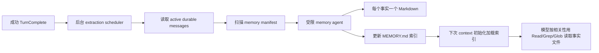

# B3：项目记忆的写入、索引、召回与更新

## 研究问题与边界

本专题聚焦主 Agent 的 project memory；同时指出 subagent persistent memory 是另一套作用域机制，不把两者混为一个存储。基线为 `872ad960de7ec172591f7e1952f7849229f94521`。

## 整体模型

项目记忆是文件系统中的长期事实，`MEMORY.md` 只做目录。每个会话默认只自动加载目录，不自动把所有事实文件塞入上下文。

## 1. 启用条件与作用域

只有 memory enabled、`use !== false`、存在 `cliStorageRoot` 且 task type 属于主 memory 类型时启用。root 由 `workspaceIdentity` 优先、否则规范化 workspace path 生成 SHA-256 前 16 位 hash，位于 CLI storage 的 `memories/projects/<slug-hash>/memory`。[project-memory.ts](../../../apps/zcode-cli/packages/core/src/runtime/helpers/project-memory.ts) [project-root.ts](../../../apps/zcode-cli/packages/core/src/memory/project-root.ts)

这意味着项目记忆与 workspace identity 绑定，不跟当前 shell `cd` 改变；冷恢复还会先从持久 session 恢复 workspace identity，再初始化 Memory root。[resume.ts:82-119](../../../apps/zcode-cli/packages/core/src/runtime/methods/resume.ts)

subagent profile 另有 `user`、`project`、`local` 三种 persistent memory root，分别落到用户存储或工作区 `.zcode` 目录。它通过 profile 配置加载，不应把其内容和主 Agent project memory 默认视为共享。[persistent-memory.ts](../../../apps/zcode-cli/packages/core/src/subagent/persistent-memory.ts)

## 2. 上下文注入与按需召回

Context 的 system 部分只注入 Memory 使用规则、文件格式、去重和更新原则。[memory.ts](../../../apps/zcode-cli/packages/core/src/context/sections/memory.ts) `MEMORY.md` 的实际内容与项目指令一起进入 meta-user request context；它明确标记为跨会话 auto-memory。[request-user-context.ts:15-86](../../../apps/zcode-cli/packages/core/src/context/sections/request-user-context.ts)

Index 最多加载 200 行和 25,000 字符，超出时截断并追加警告，要求每条保持一行、详细内容放到事实文件。[index-content.ts](../../../apps/zcode-cli/packages/core/src/memory/index-content.ts)

因此召回是两段式：索引提示“有哪些事实”，模型再依据任务使用 Read/Grep/Glob 打开相关 Markdown。仓库当前没有向量数据库、embedding 检索或自动把全部 memory body 注入请求的证据。

## 3. 直接写入与权限

系统提示要求每个事实一个带 frontmatter 的 Markdown，类型为 user、feedback、project 或 reference；写后必须更新 `MEMORY.md`。写前应查重，冲突时更新已有文件，错误事实应删除。[memory.ts:25-49](../../../apps/zcode-cli/packages/core/src/context/sections/memory.ts)

Write/Edit 只在目标位于 memory root 内、扩展名为 `.md`、路径不包含 `.git`、hooks、node_modules、skills 等敏感段时获得 memory 专用 allow。显式 deny、alwaysAsk 和 project/hook ask 不会被静默覆盖。[memory-file-permission.ts](../../../apps/zcode-cli/packages/core/src/tool/executor/memory-file-permission.ts) [memory-file-path.ts](../../../apps/zcode-cli/packages/core/src/memory/memory-file-path.ts)

Write/Edit 会在合法 memory Markdown 缺少来源时补 `metadata.node_type: memory` 与 `originSessionId`，已有 origin 保持不变。[origin-session.ts](../../../apps/zcode-cli/packages/core/src/memory/origin-session.ts) 这提供来源审计，但当前读到的召回逻辑没有按 origin 做权限过滤。

## 4. Turn 完成后的自动提取

成功 turn 在 projection 重建后调度后台 extraction，除非本次 model execution 明确要求 skip。[turn.ts:675-704](../../../apps/zcode-cli/packages/core/src/runtime/methods/turn.ts)

调度只在本地 workspace、具备 SessionStore 和 FileSystemPort、未关闭且 extraction 未禁用时工作。它按当前 active branch 截取到本轮 boundary 的 durable messages，避免随后分叉或新消息改变本次输入。[project-memory-extraction.ts:28-80](../../../apps/zcode-cli/packages/core/src/runtime/helpers/project-memory-extraction.ts)

Scheduler 串行执行并 coalesce 为最新 pending snapshot。只有成功/no-op 才推进 cursor；错误不推进，因此后续机会仍可覆盖尚未成功提取的区间。关闭 runtime 会 abort 正在执行和待执行任务；普通 close 最多有界等待 60 秒。[extraction.ts:85-180](../../../apps/zcode-cli/packages/core/src/memory/extraction.ts) [project-memory-extraction.ts:83-110](../../../apps/zcode-cli/packages/core/src/runtime/helpers/project-memory-extraction.ts)

**可复现的队列状态：**S1 正在提取时，S2、S3 先后完成 durable snapshot，scheduler 只保存最新 pending=S3；S1 结束后处理 S3，S2 不单独调用模型。若 S1 返回 success/no-op，cursor 前进到 S1 的 boundary，S3 只判断其后消息；若 S1 抛错或返回失败，cursor 不动，S3 的快照仍可能覆盖 S1 区间。若 S3 里已有主 Agent 的 Write/Edit 指向 memory root，则本次自动提取跳过并推进到 S3 boundary；若没有至少 3 个由空白分隔的词组成的非 synthetic user 文本，也跳过。这个门槛按 `split(/\s+/)` 计词，不是自然语言 tokenizer；中文无空格短句可能达不到三词。上述是源码规则推演，不代表某次模型提取实际发生。[调度与 cursor](../../../apps/zcode-cli/packages/core/src/memory/extraction.ts) · [快照构造](../../../apps/zcode-cli/packages/core/src/runtime/helpers/project-memory-extraction.ts)

若区间内已由主 Agent 直接 Write/Edit memory，自动提取跳过，避免重复写；没有至少 3 个词的非 synthetic user prose 也跳过。[extraction.ts:67-83](../../../apps/zcode-cli/packages/core/src/memory/extraction.ts) [extraction.ts:220-303](../../../apps/zcode-cli/packages/core/src/memory/extraction.ts)

## 5. 受限 Memory Agent

提取前扫描最多 200 个事实文件，读取每个文件前 30 行 frontmatter，按 mtime 排序，并将 filename、type、description 提供给 agent 用于查重。单个坏文件或 symlink 不阻断其余 manifest。[manifest.ts](../../../apps/zcode-cli/packages/core/src/memory/recall/manifest.ts)

Memory Agent 最多 5 turns，只允许 Read/Grep/Glob、只读 Bash，以及 memory root 内的 Edit/Write 和受限 rm；MCP、Agent、一般写 Bash 被拒绝。提示要求只根据最近消息提取，不再读取源码验证。[project-memory-extraction.ts:112-174](../../../apps/zcode-cli/packages/core/src/runtime/helpers/project-memory-extraction.ts) [memory-agent-loop.ts](../../../apps/zcode-cli/packages/core/src/memory/memory-agent-loop.ts)

这个边界避免后台提取演变成第二个通用 Agent，但也意味着它可能把用户陈述按原意保存，而不会独立核实事实。

## 6. 更新、冲突与过期

当前实现中，去重、冲突修正和删除主要由 prompt 规则驱动：写前查看已有文件，更新同主题事实，不创建重复；若 memory 与当前仓库或资源冲突，以当前观察为准，并更新或删除旧 memory。manifest 的 mtime 只用于排序，不是 TTL。[memory.ts:42-49](../../../apps/zcode-cli/packages/core/src/context/sections/memory.ts) [persistent-memory-prompt.ts:108-132](../../../apps/zcode-cli/packages/core/src/subagent/persistent-memory-prompt.ts)

更细看可以分成三层。**同一 Runtime 内**的 extraction scheduler 串行执行、只保留最新 pending snapshot，cursor 在成功或 no-op 后推进；它阻止同一 scheduler 自己并行写。**同一文件**的 Edit/Write 要求先有完整 Read，写前再读并比较 revision/mtime/大小；写入时向 FileSystemPort 传入 `expectedRevision` 且采用 atomic write。Node adapter 在写前 `stat` 对比 revision，不匹配会报 `stale_write`。[extraction.ts:85-180](../../../apps/zcode-cli/packages/core/src/memory/extraction.ts) [write.ts:80-145](../../../apps/zcode-cli/packages/core/src/tool/handlers/write.ts) [edit.ts:420-525](../../../apps/zcode-cli/packages/core/src/tool/handlers/edit.ts) [fs/index.ts:292-320](../../../apps/zcode-cli/packages/adapters/src/fs/index.ts) [fs/index.ts:473-485](../../../apps/zcode-cli/packages/adapters/src/fs/index.ts)

这些是有用的**乐观防护**，但不是跨 Runtime 事务：两个会话可以各自持有 scheduler 并读取同一版本；Node adapter 的 revision 检查和最终 rename 之间没有本文件级锁，两个写者仍可能在检查后先后覆盖。新文件没有 `expectedRevision`；`MEMORY.md` 与事实文件也不是一个原子提交。去重、语义合并和过期主要由 prompt 约束，manifest 的 mtime 排序不是 TTL。[project-memory-extraction.ts:75-80](../../../apps/zcode-cli/packages/core/src/runtime/helpers/project-memory-extraction.ts) [fs/index.ts:292-320](../../../apps/zcode-cli/packages/adapters/src/fs/index.ts) [fs/index.ts:700-735](../../../apps/zcode-cli/packages/adapters/src/fs/index.ts) [memory.ts:25-49](../../../apps/zcode-cli/packages/core/src/context/sections/memory.ts)

**假设竞争示例：**会话 S1、S2 都读到事实文件版本 v1；若 S1 写成 v2 后 S2 才做 revision 检查，S2 会收到 stale_write，需重新 Read。若两者都在任何 rename 前完成检查，则后写者仍可能覆盖先写者。这个例子仅说明源码所允许的时序，不声称仓库已发生丢失更新。

### 假设示例：更新而非新增

`MEMORY.md` 已列出 `feedback-testing.md`，新对话中用户补充“集成测试必须连接真实数据库，因为上次 mock 掩盖迁移错误”。Extraction manifest 会暴露已有文件描述，Memory Agent 应先 Read，再 Edit 同一文件并更新 index hook，而不是再建第二个 testing memory。这个过程是 prompt 约束下的预期行为，未作运行验证。

## 设计取舍与迁移条件

以下为研究者推断：文件式记忆让用户和 Agent 都能检查、编辑事实，索引按需加载控制 context；原有先读后写与 revision 检查减少陈旧覆盖，但语义冲突和跨 Runtime 写入仍可能发生。迁移时应保留 workspace identity、index/body 分离、受限写路径、后台提取 cursor 与 active-branch snapshot，并根据目标一致性要求增加真正的 CAS/锁或冲突合并。不能把文件原子替换误称为多文件事务。

## 验证与未知

- 已静态追踪 root、加载、直接写权限、origin stamping、自动提取、manifest 与受限 agent。
- 未实际启用 Memory、未调用模型提取、未验证多会话并发冲突。
- 未找到程序化 TTL/expiry；该结论仅限所查主 Agent project memory 路径。
